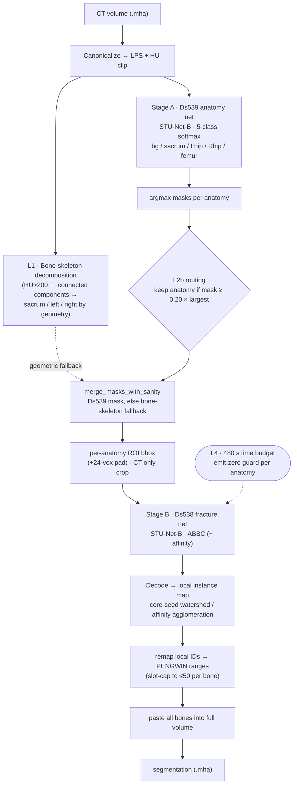
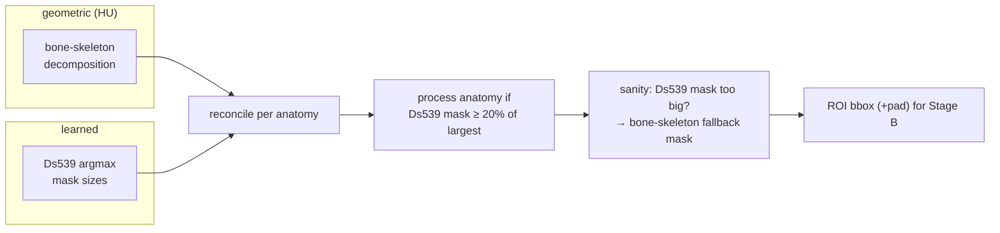
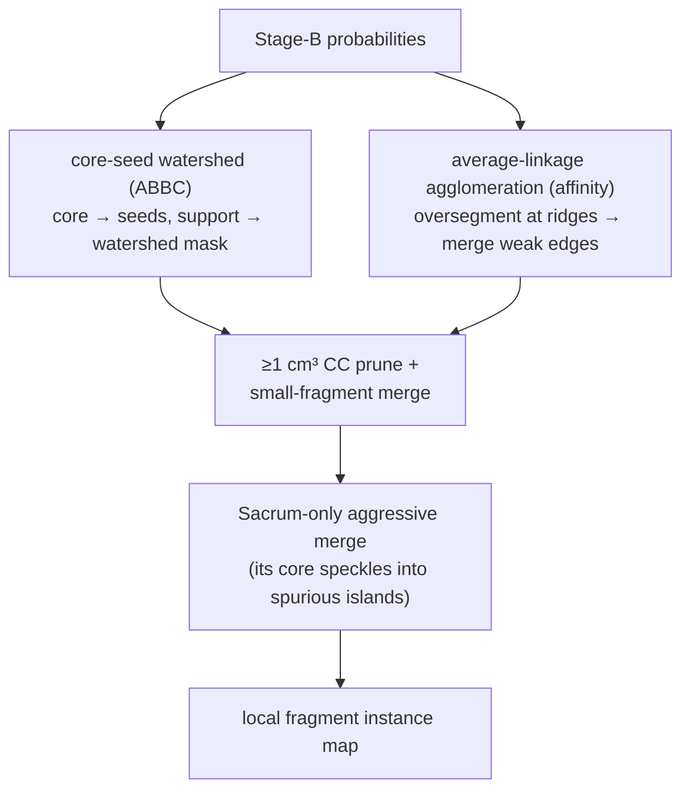

# PENGWIN 2026 — Task 1
### Peripelvic Fracture **Fragment Instance** Segmentation in CT

[](LICENSE)
[](https://github.com/MIC-DKFZ/nnUNet)
[](https://github.com/uni-medical/STU-Net)

Our submission for **Task 1** of the
[PENGWIN 2026 Challenge](https://pengwin2026.grand-challenge.org/): segment **each
individual bone fragment** of pelvic & femoral fractures in CT, as separate instances.

Training data: the official Zenodo release **[zenodo.org/records/19732767](https://zenodo.org/records/19732767)**
(340 cases). The repo ships a self-configuring **two-stage [nnU-Netv2](https://github.com/MIC-DKFZ/nnUNet)
cascade** on a **STU-Net-B** backbone, I/O-compatible with the official
[baseline](https://github.com/YzzLiu/PENGWIN2026_Task1_AutoSeg_Baseline).

---

## Upload candidate — v3.4 TotalSegmentator-init V308 (`T=0.75`)

This is a candidate submission, not yet an Active replacement for the
rollback-safe `model_v3_0`.

| | |
|---|---|
| **Stage A** | refreshed-data scratch `V301`, fold 0, `checkpoint_best.pth` |
| **Stage B** | `PengwinTrainerSTUNetBaseAffinityV308DeployedVal`, fold 0, initialized from the official TotalSegmentator `base_ep4k` backbone |
| **Decoder** | affinity average-linkage with validation-selected `AGGLO_T=0.75` |
| **Router** | unchanged v3.3 hybrid family router |
| **Bundle** | `model_v3_4_totalpretrain_t075_20260728.tar.gz` |

On the same refreshed 68-case fold-0 official-aligned proxy, the candidate at
`T=0.75` reached instance F1 `0.930066`, HD95 `3.260951 mm`, ASSD
`0.774668 mm`, and 426 split errors. The existing release scored F1 `0.933582`,
HD95 `3.857464 mm`, ASSD `1.039815 mm`, and 457 split errors. Because `T=0.75`
was selected on this validation set, the challenge upload is the independent
generalization check.

The Stage-B run stopped after completing epoch 180, at the beginning of epoch
181; the bundle therefore uses its valid `checkpoint_best.pth`, not a
`checkpoint_final.pth`.

---

## Current version — model_v3_0 (v3.3 hybrid family router)

| | |
|---|---|
| **Deployed** | **`model_v3_0`** — Stage A `V301` → v3.3 hybrid family router → Stage B `V308` → `decode_affinity_agglo` (`AGGLO_T=0.45`) |
| **Stage A/B weights** | Stage A `V301` fold0 anatomy STU-Net (Ds539, 5-class) + Stage B `V308` fold0 ABBC-affinity STU-Net (Ds538, 13ch = 4 ABBC + 9 affinity) |
| **v3.3 hybrid router** | RandomForest is **PRIMARY when confident** (`|p_femur−0.5| ≥ 0.15`); the organizers' official pelvic/femur rule is a **tiebreak only** on RF-uncertainty |
| **Router artifact** | `stage1_router/stage1_target_router_fold0.joblib` (local artifact, ignored by git; package/upload with model payload when deploying) |
| **History** | v2.2 = prelim rank 10; v3.2 (official-rule made authoritative) regressed to val rank 44 via 13% misroute; v3.3 hybrid fixed it (val rank 30). TEST phase: F1 0.898, ≈ rank 13 |
| **Why** | prevents wrong-family Stage2 calls, e.g. femur fragments in pelvic-only cases or hip/pelvis fragments in femur-only cases |

The router is not a replacement for STU-Net. It is a deterministic post-Stage-A
gate over CT/FOV/bone-geometry features (RF) with the official rule as a
tiebreak. STU-Net remains the anatomy and fragment segmentation model.

---

## TL;DR — what makes this work

| Lever | What it does | Why it matters |
|---|---|---|
| **2-stage cascade** | Stage A finds the *anatomy* (sacrum / L-hip / R-hip / femur); Stage B splits each bone into *fracture fragments* | decouples "which bone" from "how it broke" |
| **v3.3 hybrid family router** | classifies the scan as `pelvic` or `femur` (RF primary + official-rule tiebreak) and suppresses non-target anatomies before Stage B | removes wrong-family false positive fragments without changing the STU-Net weights |
| **STU-Net-B + TotalSegmentator warm-start** | a large-scale skeletal pretrain transferred to both stages | strong features from limited (340-case) data |
| **ABBC fracture target** | a 4-class `background / border / boundary / core` field (PENGWIN-2024 winner formulation) | turns instance separation into a learnable dense target |
| **Learned affinity head** | 9 multi-scale same-instance edges (short = attractive, long = **repulsive**) decoded by **average-linkage agglomeration** (GASP) | breaks the *touching-fragment merge* ceiling without mutex over-splitting |
| **Laterality-safe augmentation** | the L↔R mirror is **disabled** for the anatomy stage | a mirrored left hip with an unmirrored "LeftHip" label was teaching L↔R swaps |
| **Geometric routing + time budget** | bone-skeleton HU decomposition + Ds539 argmax, with a 480 s crop guard | robust ROI selection inside the 10-min GC limit |

---

## Label encoding

The raw label volume packs **anatomy + instance** into one integer:

| Range | Anatomy | Instances |
|------|---------|-----------|
| `0`        | background | — |
| `1 – 50`   | sacrum     | up to 50 sacrum fragments |
| `51 – 100` | left hip   | up to 50 left-hipbone fragments |
| `101 – 150`| right hip  | up to 50 right-hipbone fragments |
| `151 – 200`| femur      | up to 50 femur fragments |

So fragment `103` = "the 3rd fragment of the right hip". The pipeline predicts a
local instance map per bone, then **offsets** the IDs into these ranges.

---

## Pipeline overview



The cascade runs Stage A **once** over the whole CT, then Stage B **once per
present bone** on a tight ROI. Everything after the two networks is deterministic.

---

## Stage A — anatomy segmentation (`Dataset539_PelvicFemurAnatomyV3`)

A **STU-Net-B** model maps the whole CT to a 5-class anatomy field
(`0=bg, 1=sacrum, 2=leftHip, 3=rightHip, 4=femur`), warm-started from a
TotalSegmentator (59-bone) pretrain. Trainer `PengwinTrainerSTUNetBaseAnatomyV301`.
**Femur is fully modeled** (early versions emitted it as background).

> ### 🔑 Laterality fix
> nnU-Net's default augmentation mirrors along all 3 axes. The **sagittal (L↔R)
> mirror** flips a *left* hip into the *right* position **while keeping the
> `LeftHip` label** — directly teaching the network to confuse sides. Diagnostics
> traced **87.6 %** of hip errors to exactly this L↔R swap. Dataset539 is therefore
> registered in `DISABLE_X_MIRROR_DATASETS`, which strips **axis-2** from
> `mirror_axes` (`(0,1,2) → (0,1)`) for both training augmentation and test-time
> mirroring.

---

## Routing & robustness

Selecting the right ROI for Stage B is where a cascade usually loses recall. Two
independent signals are reconciled:



- **L1 — bone-skeleton decomposition** (always on): threshold `HU > 200`, take
  connected components, split the pelvis into center/left/right by geometry.
  A reliable *presence* prior that needs no model.
- **L2 / L2b — Ds539 argmax + relative-volume routing**: every anatomy whose
  Ds539 mask is ≥ 20 % of the largest present mask is processed. A genuinely
  present bone is never routed to zero; a small hallucination is dropped by the
  fraction gate.
- **sanity / fallback**: if the Ds539 mask is implausibly large it is replaced by
  the geometric bone mask.
- **L4 — 480 s time budget**: a per-anatomy ETA guard guarantees the 10-minute
  Grand-Challenge per-case limit (it emits zero for an anatomy only if the crop
  would blow the budget).
- **v3.3 hybrid family router**: after Stage A, a small random-forest router
  predicts the case family (`pelvic` or `femur`) from CT shape/FOV/HU and sampled
  bone-geometry features. The RF is **primary when confident** (`|p_femur−0.5| ≥
  0.15`); the organizers' official pelvic/femur rule is a **tiebreak only** on
  RF-uncertainty. The router then forces Stage B to run only
  `Sacrum+LeftHip+RightHip` for pelvic cases or `Femur` for femur cases. This
  blocks wrong-family fragments while preserving the original Stage A and Stage B
  STU-Net weights.

---

## Stage B — fracture instance segmentation (`Dataset538_PelvicFemurBICMFragmentV5`)

For each routed bone, a **CT-only** ROI (bone-LUT windowed CT, 1 channel) is run
through a STU-Net-B model.

> ### 🔒 Leak-free, CT-only input
> An earlier design fed Stage B a 3-channel ROI `[CT, Ds539-anatomy-prob, SDF]`.
> That **leaked** the Stage-A prediction into Stage B and inflated offline scores.
> Stage B is now **pure CT** — the Ds539 probability is used *only* to localize the
> ROI bbox (routing), never as a model input.

### ABBC representation (the 4-class target)

Instead of predicting instances directly, Stage B predicts a dense **ABBC** field
that makes fragment separation learnable:

| Ch | Class | Meaning |
|----|-------|---------|
| 0 | `background` | outside the bone |
| 1 | `border`   | outer bone surface |
| 2 | `boundary` | **inter-fragment fracture surface** (where two fragments touch) |
| 3 | `core`     | eroded fragment interior (the watershed seed) |

The eroded **core** gives one seed per fragment; the **boundary** marks the cut
between touching fragments. This is the formulation used by the PENGWIN-2024
1st-place method.

### Affinity head (the merge-breaker)

The ABBC `boundary` channel is noisy where fractures are *closed* (fragments
pressed together). To break that ceiling, the head also predicts **9 same-instance
affinity edges** at three scales:

```
offset (Δz,Δy,Δx)            role
(1,0,0) (0,1,0) (0,0,1)      short-range  → attractive (glue a fragment together)
(3,0,0) (0,3,0) (0,0,3)      mid-range
(9,0,0) (0,9,0) (0,0,9)      long-range   → repulsive (separate touching fragments)
```

Each edge predicts "do these two voxels belong to the same fragment?". Trained
with a **class-balanced** BCE (`0.5·(L_same + L_diff)`) so the rare
cross-fracture edges aren't drowned by the ~95 % same-instance pairs. The
long-range repulsive edges are the lever that separates pressed-together
fragments. (Head = `4 ABBC + len(AFFINITY_HEAD_OFFSETS)` channels.)

---

## Decoding instances



- **Core-seed watershed** (ABBC decode): label the cores as markers, flood a
  watershed over the non-background support; prune sub-1 cm³ components and merge
  slivers. An **anatomy-specific** rule applies an aggressive size-ratio + minimum-
  component merge to the **sacrum only** (one dominant bone whose predicted core
  tends to speckle into spurious islands), while the multi-fragment hips/femur keep
  the defaults.
- **Average-linkage agglomeration** (affinity decode): oversegment the foreground
  at affinity ridges, then conservatively merge adjacent supervoxels whose shared
  interface affinity is weak — the GASP "mean linkage" criterion, which is far more
  noise-robust than mutex-watershed (`GASP-AbsMax`).

---

## Post-processing & output

1. The local instance map is resampled back to the original CT grid.
2. Local IDs are **offset** into the official ranges (sacrum `1–50`, leftHip
   `51–100`, rightHip `101–150`, femur `151–200`); if a bone yields more than 50
   fragments only the 50 largest are kept (PENGWIN slot cap).
3. All bones are pasted into one volume and written as the final `.mha`.

---

## Training

```bash
# Stage A (anatomy, 5-class)        — STU-Net-B warm-start, L/R-mirror OFF
PYTHONPATH=code_task1 nnUNet_raw=... nnUNet_preprocessed=... nnUNet_results=... \
python code_task1/train.py stunet-finetune 539 3d_fullres all \
    -tr PengwinTrainerSTUNetBaseAnatomyV301 -p nnUNetResEncUNetLPlans \
    -pretrained_weights weights/pretrained_models/base_ep4k.model --npz

# Stage B (fracture, ABBC + affinity)
python code_task1/train.py stunet-finetune 538 3d_fullres all \
    -tr PengwinTrainerSTUNetBaseAffinityV308 -p nnUNetResEncUNetLPlans \
    -pretrained_weights weights/pretrained_models/base_ep4k.model --npz
```

- **`stunet-finetune`** monkey-patches nnU-Net's pretrained loader with a STU-Net
  loader that handles the `seg_outputs.*` head naming, class-count mismatch
  (105 → 5 / 13, head re-init), and 1-channel stem.
- **Datasets** are rebuilt deterministically from the GT labels
  (`preprocessing.gen_nnunet_dataset`): Stage A maps instance IDs → anatomy class;
  Stage B builds per-anatomy ROIs with the ABBC target. The Ds538 label *is* the
  instance map (no sidecar) — nnU-Net preserves instance IDs through the
  anisotropic resample.
- A single **source-case grouped split** (seed 12345) is shared by both stages, so
  a held-out fold is held out across the whole cascade.

---

## Performance (held-out dev proxy)

Held-out grouped fold-0 (per-anatomy ROIs), official-aligned proxy:

| metric | overall | Femur | RightHip | LeftHip | Sacrum |
|---|---|---|---|---|---|
| Fracture Dice | **0.95** | 0.85 | 0.85 | 0.76 | 0.73 |
| Instance F1   | **0.76** | 0.95 | 0.95 | 0.88 | 0.89 |

> The official Grand-Challenge evaluator is unpublished; numbers above are an
> aligned **proxy** and a panoptica-based GC-aligned scorer. Measured end-to-end
> runtime ≈ 60–205 s/case, within the T4 / 10-min budget.

### v2.0 router ablation on local fold0 validation

Same 68-case fold0 validation split used to evaluate the target-family router
(34 pelvic, 34 femur; router trained on the remaining 272 cases). The baseline is
the original v1.5 automatic Stage1 routing; the v2.0 row is the same Stage A/B
weights with target-family routing before Stage B.

| Scope | N | FG Dice v1.5 | FG Dice v2.0 | Delta | IoU-F v1.5 | IoU-F v2.0 | Delta | Prec@0.5 v1.5 | Prec@0.5 v2.0 | Delta | F1@0.5 v1.5 | F1@0.5 v2.0 | Delta |
|---|---:|---:|---:|---:|---:|---:|---:|---:|---:|---:|---:|---:|---:|
| Overall | 68 | 0.7757 | 0.9761 | +0.2005 | 0.6827 | 0.6825 | -0.0002 | 0.5027 | 0.8485 | +0.3458 | 0.5568 | 0.7699 | +0.2131 |
| Pelvic | 34 | 0.8904 | 0.9790 | +0.0886 | 0.6274 | 0.6284 | +0.0010 | 0.6786 | 0.7918 | +0.1132 | 0.6632 | 0.7132 | +0.0500 |
| Femur | 34 | 0.6609 | 0.9733 | +0.3124 | 0.7380 | 0.7366 | -0.0014 | 0.3268 | 0.9051 | +0.5783 | 0.4504 | 0.8266 | +0.3762 |

Interpretation: v2.0 mostly removes wrong-family false positives. Fragment
localization (`IoU-F`, `Recall@0.5`) is nearly unchanged, while foreground Dice,
precision, and F1 improve because predicted fragments drop from 654 to 424.

---

## Repository layout

```
github_repo/
├── inference/
│   ├── inference.py              # container entrypoint — 2-stage cascade + routing + decode
│   ├── agglo_decode.py           # average-linkage agglomeration decoder (vendored)
│   ├── target_family_router.py   # v2.0 CT/FOV/bone-geometry router runtime
│   └── pengwin_trainers_shim.py  # nnU-Net trainer-discovery shim (re-exports core trainers)
├── code_task1/                   # single source of truth (mirror of the live training code)
│   ├── core.py                   # STU-Net trainers + grouped split + nnU-Net env
│   ├── model.py                  # STU-Net-B backbone + warm-start loader
│   ├── loss.py                   # ABBC + class-balanced affinity loss
│   ├── preprocessing/            # dataset builds (gen_nnunet_dataset, gen_BICM_V5_target, sidecars)
│   ├── utils.py, eval.py         # anatomy registry, decoders, official metrics
│   └── train.py, visualize.py    # nnU-Net entry + `stunet-finetune` launcher
├── Dockerfile                    # GC container (env selects the deployed trainer + decode)
├── docs/                         # description.md/.pdf, Comment.txt, AlgorithmRegistration.txt
└── README.md
```

> Model weights (`model.tar.gz`) and router artifacts (`*.joblib`, e.g.
> `stage1_router/stage1_target_router_fold0.joblib`) are **not** committed.
> Upload/package them with the Grand-Challenge model payload; GC's *Link to
> GitHub* flow builds the container from a tagged release.

---

## Build & submit

```bash
git push origin main
git tag v3.3 && git push origin v3.3
# Grand Challenge → Container Images → Link to GitHub → select tag v3.3 → wait for "Active"
# Upload model.tar.gz to the algorithm's "Models" tab
# Submit: paste docs/Comment.txt, upload docs/description.pdf, select Algorithm, Submit
```

Daily quota: 10 submissions/day, 10-minute per-case timeout. The deployed Stage-B
trainer, decoder, and router are selected by Dockerfile `ENV` (for example
`PENGWIN_DS538_TRAINER`, `PENGWIN_AFFINITY_DECODE`, and `PENGWIN_TARGET_ROUTER`).
With `PENGWIN_TARGET_ROUTER=1`, the router joblib must be present in the model
payload or inference fails fast.

---

## Method vs the official baseline

| Aspect | Official baseline | This repo |
|---|---|---|
| Backbone | nnU-Net ResEnc | **STU-Net-B** (TotalSegmentator warm-start) |
| Stage-B target | 3-class CSM (`bg/fg/contact`) | **4-class ABBC** (`bg/border/boundary/core`) + **9-edge affinity** |
| Stage-B input | per-bone masked CT | **CT-only, leak-free** (anatomy prob used only for routing) |
| Decoder | CC + KD-tree NN | **core-seed watershed** + **average-linkage agglomeration** + sacrum merge |
| Laterality | default (mirror all axes) | **L↔R mirror disabled** for anatomy (87.6 % of hip errors) |
| Routing | volume ratio | bone-skeleton ∪ Ds539 argmax + sanity fallback + **v3.3 hybrid family router** + **time budget** |
| ID offset | user post-step | embedded in `inference.py` |

The label range, file naming, `dataset.json` schema, and output contract are
identical to the baseline — only the algorithm differs.

---

## Acknowledgements

Built on [nnU-Netv2](https://github.com/MIC-DKFZ/nnUNet) (Isensee et al., *Nature
Methods* 2021), the [STU-Net](https://github.com/uni-medical/STU-Net) large-scale
skeletal pretrain, the **ABBC** fragment formulation from the PENGWIN-2024
1st-place method, and **GASP** average-linkage agglomeration (Bailoni et al.,
CVPR 2022) for affinity decoding.
