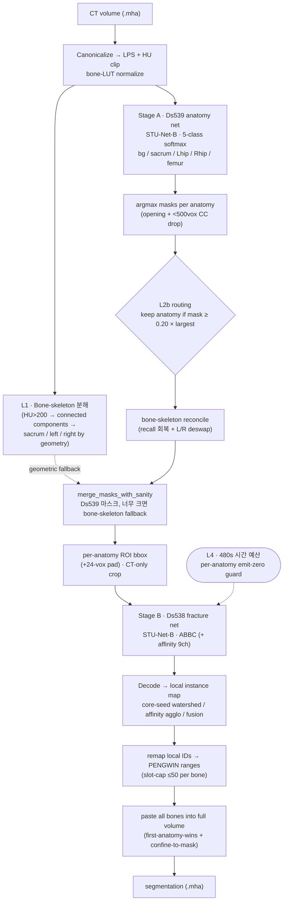
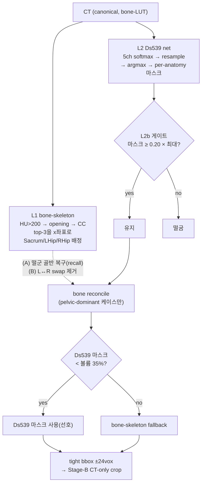
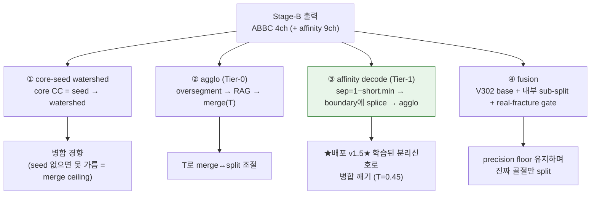
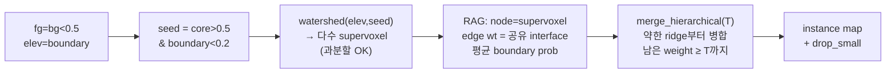
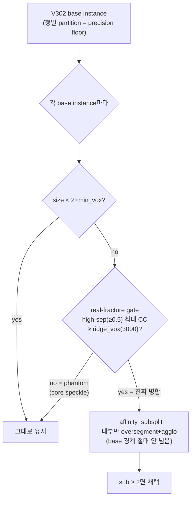

# PENGWIN 2026 — Task 1: 3D 골반 CT 골절 조각 Instance 분할

[](LICENSE)
[](https://github.com/MIC-DKFZ/nnUNet)
[](https://github.com/uni-medical/STU-Net)

> **PENGWIN 2026 Grand Challenge — Task 1**: 골반·대퇴 CT에서 천골(Sacrum)/좌관골(LeftHip)/우관골(RightHip)/대퇴(Femur)의 **각 골절 조각(fragment)을 개별 인스턴스(instance)로 분할**하는 과제.
>
> 본 저장소는 **2-stage cascade**(해부학 분할 → 골절 인스턴스 분할) + **ABBC core-seed watershed / affinity average-linkage agglomeration** 디코드 파이프라인의 전체 구현, 실험 연대기, 학습 인프라 교훈을 담는다.


> **위 예시 — Case 001 (골반: 천골+좌/우관골)** CT의 **골절 조각 instance 분할** (axial·coronal·sagittal MIP, 색 = 조각 ID). 핵심 난점: 같은 뼈 안에서 **맞닿은 골절 조각들을 서로 다른 인스턴스로 분리**하는 것(단순 의미 분할이 아님).

---

## 🧪 업로드 후보 — v3.4 TotalSegmentator-init V308 (`T=0.75`)

> **후보이며 아직 Active 승격 전이다.** 기존 `model_v3_0`/v3.3 hybrid router는
> 롤백 가능한 기준 모델로 유지한다.

| | |
|---|---|
| **Stage A** | refreshed-data scratch `V301`, fold 0, `checkpoint_best.pth` |
| **Stage B** | `PengwinTrainerSTUNetBaseAffinityV308DeployedVal`, fold 0, TotalSegmentator `base_ep4k` backbone 초기화 |
| **Decoder** | affinity average-linkage, validation-selected `AGGLO_T=0.75` |
| **Router** | v3.3 hybrid family router 유지(RF confident-primary, official-rule tiebreak) |
| **모델 번들** | `model_v3_4_totalpretrain_t075_20260728.tar.gz` |
| **Checkpoint 상태** | Stage-B 학습은 epoch 180 완료 후 epoch 181 시작점에서 중단; 유효한 `checkpoint_best.pth` 사용 |

동일한 refreshed fold-0 68-case official-aligned proxy에서:

| 구성 | Fragment Dice | HD95 mm ↓ | ASSD mm ↓ | Instance F1 | Split ↓ |
|---|---:|---:|---:|---:|---:|
| 기존 release V301+V308 | 0.884121 | 3.857464 | 1.039815 | **0.933582** | 457 |
| scratch V301+V308 | 0.865772 | 4.009136 | 0.927063 | 0.846223 | 537 |
| v3.4 후보, 고정 `T=0.45` | **0.885355** | 3.422187 | 0.800181 | 0.921553 | 456 |
| v3.4 후보, 선택 `T=0.75` | 0.882088 | **3.260951** | **0.774668** | 0.930066 | **426** |

`T=0.75`는 같은 validation set에서 선택한 값이므로 challenge upload는
일반화 확인을 위한 후보 제출이다. 기존 release 대비 F1 차이는 `-0.003516`,
precision은 사실상 동일하며 HD95/ASSD/split은 개선됐다.

---

## 🚀 현재 배포 상태 (2026-07-25, **model_v3_0** — 라우터 v3.3 HYBRID · TEST phase F1 0.898 ≈ rank 13)

> **DEPLOYED Active = `model_v3_0`** = Stage-A `V301`(Ds539, 5-class) → **v3.3 하이브리드 family 라우터**
> → per-anatomy ROI → Stage-B `V308`(Ds538, 13ch = 4 ABBC + 9 affinity) → `decode_affinity_agglo`
> (`AGGLO_T=0.45`). 배포 env: `DS538_FOLD=0`, `OUT_CH=13`, `AFFINITY_DECODE=1`, `TARGET_ROUTER=1`,
> `CHECKPOINT=checkpoint_best.pth`.
>
> **v3.3 HYBRID 라우터.** RF(RandomForest joblib)가 **확신할 때(|p_femur−0.5| ≥ 0.15) PRIMARY**,
> 조직위 공식 pelvic/femur rule 은 RF 가 불확실할 때만 **TIEBREAK**. 이력: v2.2 = 예선 rank 10;
> **v3.2**(공식 rule 을 AUTHORITATIVE 로 승격)는 우리 분포에서 13% 오라우팅으로 val rank 44 로 REGRESS;
> **v3.3 하이브리드**가 이를 FIX(val rank 30). TEST phase 실측: **F1 0.898, ≈ rank 13**.
>
> **REFUTED/dead 레버(배포 금지)**: V371/V370(from-scratch full-budget, val rank 45 — 예산은 병목이 아님),
> V360(synth-on-affinity), V340(amplified LUT), V352/V353(synth-aug), MAT/medial_skeleton(precision 퇴보),
> X-CAC/V304, embedding/V320, V303 mutex, v2.3 Stage-2 fold_all(rank 44).

### 🗄️ 이전 상태 (이력): v3.0 통합 릴리스 (2026-07-22, 런타임 = v2.4, 기준 v2.2 = GC rank 10)

> **v2.4 = v2.2 + 라우터 OOD abstention 게이트.** 기본 설정에서 **알려진 모든 데이터에 대해 동작이
> 동일함이 증명됨**: 340 학습케이스 전수 측정에서 RF 결정 margin 최소값이 **0.9052**(0.90 미만 0건)이고
> 임계값 기본이 0.85라 게이트가 발동하지 않는다. GC 공식 prelim 5케이스 재현 검증도 PASS
> (margin 0.9937~0.9988, abstention 발동 0회).
>
> **왜 rule ∧ RF 합의 방식이 아닌가.** 조직위 공식 rule 을 340 케이스에서 실측한 결과:
> rule 50.6% vs RF **100%**, 두 신호가 **49.4%(168건)에서 불일치**하며 그 불일치에서
> **RF 168/168 정답, rule 0/168**. 합의-실패 시 타이브레이크 설계였다면 전체 라우팅 결정의 절반을
> GC F1 0.572 를 냈던 Ds539 부피 신호에 넘기게 된다. 그래서 **RF 가 스스로 불확실할 때만**
> (margin < 0.85) rule·해부증거와 3자 투표한다. `PENGWIN_ROUTER_ABSTAIN_MARGIN=0` 으로 완전 비활성.

**모델 번들 = `model_v3_0.tar.gz`** (`sha256 560dff90…`). 가중치는 v2.2(rank 10)와 **md5 동일**,
Stage-1 라우터 pickle 만 sklearn **1.6.1 네이티브**로 재직렬화(1.7.2 판은 컨테이너 sklearn 1.6.1 에서
로드 시 경고 302건 → 0건). 300개 트리·`predict_proba` 소수점 6자리까지 동일 검증. GC val 재현 PASS
(인스턴스 6지표 v2.2 와 비트 동일).

### ⚰️ v2.3 (Stage-2 fold_all) — GC val 에서 REFUTED, **rank 10 → 44**
`model_v2_3.tar.gz` = v2.2 에서 Stage-2 V308 fold_0(272케이스) → fold_all(340) 만 교체. **올리지 말 것.**

| 지표 | v2.2 | v2.3 | Δ |
|---|--:|--:|--:|
| ins_f1 | 0.9364 | 0.8862 | −0.0502 |
| ins_recall | 0.9433 | 0.8967 | −0.0467 |
| merge_error_count | 0.2000 | 0.2000 | 0.0000 |
| topology_consistency | 0.9333 | 0.8667 | **−0.0667** |
| fracture_hd95 | 5.2987 | 7.0969 | **+1.80 mm** |

**10개 지표 중 개선 0개.** Stage-1 fold_all 은 v2.2 의 rank 13→10 을 만들었지만 **Stage-2 fold_all 은
정반대로 해롭다** — fold_all 은 held-out 이 없어 checkpoint 를 자기 학습 데이터로 고르고, 인스턴스
분할이 그 오염에 훨씬 민감하다. 또한 이 실측으로 **`topology_consistency`(병합된 PART 수)와
`merge_error_count`(병합 EVENT 수)가 독립**임이 확인됐다(case 001: topology 0.667→0.333 인데 merge 불변).
상세: `docs/task1/v2_3_verdict.md`(로컬 저장소).

## 🚀 이전 배포 상태 (v2.2 = GC rank 10)

| | |
|---|---|
| **배포 버전** | **v2.2** — 예선 종료 시점 GC 리더보드 **10위**. 태그 `v2.2` (커밋 `4542487`) |
| **파이프라인** | Stage-A `V301`(해부, fold_0) → **37-feature RF family 라우터** → Stage-B `V308`(골절 affinity, **fold_0**) → average-linkage agglomeration decode (`AGGLO_T=0.45`) |
| **모델 번들** | `model_v2_2.tar.gz` — sha256 `ea55f284…` 핀 고정. **rank-10 floor, 절대 삭제 금지** |
| **순위를 만든 것** | **타깃 family 라우터** — GC instance F1 **0.57 → 0.94** (≈33위 → 12위). 이후 Stage-A 체크포인트 교체로 10위 |
| **v2.2 예선 지표** | ins_f1 0.9364 / recall 0.9433 / precision 0.9397 / dice 0.9219 / hd95 5.299 / assd 1.708 / topology 0.9333 / merge 0.2 / split 0.1333 |
| **남은 병목** | **merge(과소분할)**. 근본원인 = 입력 대비 — 골절 계면의 87%가 CT에서 융합돼 있고 bone-LUT 상 대비가 ~5%뿐 |
| **순위 규칙** | GC는 **10개 지표의 평균 순위(Mean Position)** 로 정렬한다. 화면의 `Score (Dice)`는 정렬 키가 **아니다** |

> ⚠️ **재빌드 시 주의.** 새 태그를 push해도 GC의 Active 이미지는 자동으로 바뀌지 않는다(수동 선택).
> 재빌드본은 반드시 스모크 검증 — `len(np.unique(output)) > 1` assert — 을 통과한 뒤에만 Active로 올릴 것.
> **"job succeeded"는 성공의 증거가 아니다**: 가중치 로드가 실패해도 포괄 예외 처리가 all-zero를 쓰고
> `return 0` 하므로 GC는 GREEN으로 기록하면서 전 케이스 0점이 된다. 로그에서 `w0sum ≈ 104`
> (95 미만이면 랜덤 네트워크)와 `target-router: loaded ... n_features=37` 을 함께 확인하라.

---

### 이전 상태 (이력): v2.0 (2026-07-06)

| | |
|---|---|
| **버전** | **v2.0** — v1.5 cascade에 target-family router를 추가한 버전 |
| **파이프라인** | Stage-A `V301`(해부 STU-Net, fold_0) → **target-family router**(`pelvic`/`femur`) → Stage-B `V308`(골절 affinity, fold_0) → affinity average-linkage agglomeration decode (`AGGLO_T=0.45`) |
| **모델 번들** | Stage-A/Stage-B weight는 v1.5와 동일. 추가 artifact: `stage1_router/stage1_target_router_fold0.joblib` |
| **v1.5 → v2.0 변경** | STU-Net weight는 그대로 두고, Stage-A 뒤에 CT/FOV/bone-geometry 기반 random-forest router를 붙여 target family가 아닌 anatomy를 Stage-B에 넘기지 않음 |
| **실제 GC 점수 (v1.5 = V308 fold_0)** | instance **F1 ~0.572** / Recall 0.574 / Dice 0.919 / HD95 5.31 — **Mean Position 최고** |
| **local fold0 validation 참고치** | 68 cases(34 pelvic/34 femur)에서 기존 v1.5 대비 FG Dice **0.7757→0.9761**, F1@0.5 **0.5568→0.7699**. IoU-F는 거의 동일(0.6827→0.6825)하므로 개선은 주로 wrong-family FP 제거에서 발생 |
| **router artifact 정책** | `*.joblib` 및 `stage1_router/`는 gitignore. Grand Challenge 배포 시 model payload와 함께 별도 패키징/업로드 |

> **폐기된 실험** (아래 "실험 연대기"는 history로만 보존): `V312` Stage-B cascade warm-start = V308과 **무승부(tied)** → 미채택 · `V311` Stage-A fold_all = dev wash · `V313` Large = rejected · `V304` X-CAC loss = within-noise · fusion/reconcile = GC 퇴보(v1.8 rollback). **수렴한 최선 = V308 affinity + average-linkage**. 상세: [`docs/legacy-removed-trainers.md`](docs/legacy-removed-trainers.md).

## 목차

1. [프로젝트 개요](#1-프로젝트-개요)
2. [평가 지표 (GC 메트릭)](#2-평가-지표-gc-메트릭)
3. [전체 파이프라인](#3-전체-파이프라인)
4. [알고리즘 상세](#4-알고리즘-상세)
5. [실험 여정 (연대기)](#5-실험-여정-연대기)
6. [학습 인프라 교훈](#6-학습-인프라-교훈)
7. [현재 상태 & 결과](#7-현재-상태--결과)
8. [재현 방법](#8-재현-방법)
9. [부록](#9-부록)

---

## 1. 프로젝트 개요

### 1.1 대회 / 태스크

- **대회**: PENGWIN 2026 (PElvic boNe fraGments Window) Grand Challenge — Task 1
- **데이터**: Zenodo `https://zenodo.org/records/19732767` — 총 500 케이스(Training 340 + Test 160), MetaImage `.mha` 포맷, 케이스당 `image.mha` + `label.mha`
- **목표**: 골반·대퇴 CT에서 골절로 쪼개진 **각 뼈 조각을 개별 인스턴스로** 분할. 단순 의미 분할(semantic)이 아니라, 같은 해부학(예: 천골) 안에서 서로 맞닿은 골절 조각들을 **서로 다른 ID로 분리**해야 한다.
- **배포 환경**: Grand Challenge 컨테이너 — T4 16GB GPU, 케이스당 10분 Docker 시간 제한.

### 1.2 PENGWIN 공식 라벨 ID 범위

골절 조각 ID는 해부학별로 정해진 범위를 가지며, 한 해부학 안에서 ID는 비연속일 수 있다(예: 천골 `{1, 3, 5}` 유효).

| ID 범위 | 해부학 | 최대 조각 수 |
|---|---|---|
| `0` | background | — |
| `1 – 50` | Sacrum (천골) | 50 |
| `51 – 100` | LeftHipbone (좌관골) | 50 |
| `101 – 150` | RightHipbone (우관골) | 50 |
| `151 – 200` | Femur (대퇴) | 50 |

### 1.3 학습 데이터 분포 (340 케이스)

| 유형 | 케이스 | 사용 라벨 범위 |
|---|---|---|
| Pelvic-only (천골 + 좌/우관골, 대퇴 없음) | 170 | 1–150 |
| Femur-only (골반 없음) | 170 | 151–200 |
| Mixed | 0 | — |

조각 통계(총 2,427 조각): 천골 484(평균 2.85/케이스), 좌관골 707(4.16), 우관골 644(3.79), 대퇴 592(3.48).

### 1.4 무엇이 어려운가 — Instance 분할 = 골절 조각 분리

이 과제의 핵심 난점은 **표면(surface) 품질이 아니라 인스턴스 분할(partition)** 이다.

- **Surface(의미 분할)는 이미 강함**: GC 리더보드에서 Fracture Dice ~0.92, HD95 ~5.3mm, ASSD ~1.7mm로 top-6~15위 수준 (2024 우승자 ASSD 1.84mm에 근접).
- **Instance 분할이 발목**: F1/Recall/Precision/Topology가 56~62위. 근본 원인은 **under-segmentation(병합, merge)** — 맞닿은 골절 조각들을 모델이 하나의 덩어리로 예측한다.
- **왜 어려운가**: 닫힌 골절면(closed fracture plane)에서 조각을 가르는 경계는 voxel 단위로 보면 1복셀 두께에 불과해 voxel-overlap 기반 Dice+CE 손실에는 거의 보이지 않는다(loss-metric mismatch). 결과적으로 모델은 "병합된 core"를 예측하고, watershed 디코드는 **존재하지 않는 seed로부터 인스턴스를 만들어낼 수 없으므로** 분리에 실패한다.

> 한 줄 요약: **PQ = SQ × RQ**. SQ(매칭된 인스턴스의 표면 Dice) ~0.95로 거의 완벽하지만, RQ(Instance F1) ~0.55가 병목 — 약 40~47%의 GT 조각이 병합되어 있다.

---

## 2. 평가 지표 (GC 메트릭)

> **주의**: 2026 공식 GC 평가기는 **미공개**라 byte-exact 재현이 불가능하다. 본 프로젝트는 두 종류의 로컬 프록시를 운영한다.
> - `eval.py task1-abbc-eval` — official-aligned v2 proxy (per-anatomy argmax IoU≥0.10 매칭).
> - `experiments/eval_panoptica_gc.py` — panoptica 기반 GC-aligned 평가기(격리 conda env `pengwin_mws`). GC 필드명이 panoptica와 정확히 일치(RQ=F1, SQ=mean Dice over TP, PQ=SQ×RQ)하므로 **상대 비교**(V302 vs V308 등)에 신뢰 가능.

### 2.1 메트릭 세트

| 메트릭 | 정의 | 축 |
|---|---|---|
| **Fracture Dice** | 매칭된 (pred, GT) 조각쌍의 Dice | surface |
| **Local Dice (20mm)** | 골절면 20mm 이내 영역의 Dice | surface |
| **HD95 (mm)** | Hausdorff 95퍼센타일 거리 | surface |
| **ASSD (mm)** | 평균 대칭 표면 거리 | surface |
| **Instance F1 / Recall / Precision** | per-anatomy argmax IoU 매칭 기반 | **instance** |
| **Merge Error** | 병합 오류 개수(rate 아님) | **instance** |
| **Split Error** | 과분할 오류 개수 | **instance** |
| **Topology Consistency** | 조각별 연결성(연결 성분 수) 보존율 | **instance** |
| **num_parts** | 조각 개수 정합 | instance |

### 2.2 계산 규칙

- 해부학 범위 강제: Sacrum 1-50 / LeftHip 51-100 / RightHip 101-150 / Femur 151-200.
- GT 조각 필터: `< 500 mm³` GT 조각 제거 (`--gt-fragment-min-mm3 500`).
- CC prune: pred/GT 모두 `< 1 cm³ (1000 mm³)` 연결 성분 제거 (`--cc-prune-mm3 1000`). 이는 공식 메트릭의 1cm³ CC-prune과 일치하므로 `MIN_COMPONENT_VOXELS=1820`(≈1.05cm³)은 red herring이다.
- 매칭: per-anatomy argmax IoU, threshold **0.10** (글로벌 Hungarian + IoU≥0.5 아님).
- 반드시 per-sample(held-out ROI) 평가 — full-case 평가는 학습 ROI 누수 발생.

### 2.3 어떤 게 약점이고 왜인가 (GC 점수 분해)

| 축 | 메트릭 | GC 순위 | 평가 |
|---|---|---|---|
| Surface / semantic | Fracture Dice 0.919, Local Dice, HD95 5.31mm, ASSD 1.72 | 6–15위 | **강함(상위권)** |
| Instance | F1 0.572(56), Recall 0.574(56), Precision 0.575(62), Topology 0.567(59), Split(49) | 41–62위 | **약함(하위권)** |

**Mean Position ≈ 32.9 = 강한 surface 축이 약한 instance 축에 끌려내려간 것.**

결정적 단서: GC 예비 5케이스에서 **모든 케이스가 recall = precision** (예: 005 = 0.33/0.33, 004 = 0.5/0.5). 즉 FN ≈ FP ⟹ 조각 **개수는 맞추는데 partition(분할)이 틀림** + 일단 검출되면 Dice 0.97+. 컨테이너 로그가 드러낸 두 실패 메커니즘:

- **(FN) 전체-해부학 누락 / 좌우 스왑** = recall killer: Ds539가 해부학을 0복셀로 주거나 L↔R을 바꾸면 `keep_frac=0.20` 게이트가 통째로 떨궈 0 출력.
- **(FP) over-split** = precision killer: V308-solo 디코드가 천골 9조각, 우관골 5조각으로 과분할.

> 단 하나 남은 레버 = **모델의 merge ceiling(병합 한계)**. surface 품질은 이미 2024 우승자급이라 추가 작업 불필요.

---

## 3. 전체 파이프라인

### 3.1 2-stage cascade 개요

```
raw .mha (340 cases = pelvic 170 + femur 170)
        │
        ▼
Stage A — 해부학   Dataset539_PelvicFemurAnatomyV3
                   5-class semantic: 0=bg / 1=Sacrum / 2=LeftHip / 3=RightHip / 4=Femur
                   STU-Net-B · PengwinTrainerSTUNetBaseAnatomyV301
        │ anatomy probability
        ▼
라우팅            target-family router + anatomy argmax 마스크
                  → target family만 per-anatomy ROI bbox(+24vox pad)
        │
        ▼
Stage B — 골절    Dataset538_PelvicFemurBICMFragmentV5
                   4-class ABBC: 0=bg / 1=border / 2=boundary / 3=core (+9 affinity)
                   입력: CT-only 1채널 (leak-free) · STU-Net-B + BADB
        │
        ▼
디코드            core-seed watershed / affinity average-linkage agglomeration / fusion
        │
        ▼
조립             per-bone fragment ID → 공식 range offset → per-case .mha
                 Sacrum 1-50 / LeftHip 51-100 / RightHip 101-150 / Femur 151-200
```

### 3.2 파이프라인 도식 (mermaid)



---

## 4. 알고리즘 상세

### 4.1 Stage-A — 해부학 분할 (Dataset539, 5-class)

**백본**: STU-Net-B (58.26M params, Apache-2.0), TotalSegmentator 59-bone 사전학습 체크포인트(`base_ep4k.model`)에서 warm-start. ResEnc-L 백본을 대체. nnUNet plan `nnUNetResEncUNetLPlans` / data identifier `nnUNetPlans_3d_fullres` 재사용.

- **STU-Net 구조**: 6 encoder stage + 5 decoder stage의 3D residual U-Net. max-pooling 대신 strided conv로 다운샘플 → stride가 바뀌어도 사전학습 가중치 shape가 보존됨. 변형별 차이는 `dims`(채널폭)·`depth`(stage당 residual block 수)뿐.

  | Variant | dims | depth | params |
  |---|---|---|---|
  | small | [16,32,64,128,256,256] | [1,1,1,1,1,1] | ~14.6M |
  | **base (채택)** | [32,64,128,256,512,512] | [1,1,1,1,1,1] | ~58.26M |
  | large | [64,128,256,512,1024,1024] | [2,2,2,2,2,2] | ~440.3M |
  | huge | [96,192,384,768,1536,1536] | [3,3,3,3,3,3] | ~1.46B |

- **5-class**: 0=bg / 1=Sacrum / 2=LeftHip / 3=RightHip / 4=Femur.

- **손실 = `MarginalDiceCELoss` (핵심 혁신)**: Ds539는 부분 라벨(partial label)이라 pelvic 케이스는 1/2/3만, femur 케이스는 4만 라벨링되어 있고 나머지 뼈는 강제로 background 처리된다. 이를 표준 DC+CE로 학습하면 케이스 간 supervision 모순이 발생.
  - **Marginal CE**: 라벨되지 않은 fg 클래스를 background super-group에 `logsumexp`로 접어 넣음. bg 타겟의 log-prob = `logsumexp(logits[bg_group]) − logsumexp(logits[all])` → 거기에 라벨 안 된 뼈 클래스를 예측해도 penalty가 0.
  - **Marginal Dice**: 각 샘플에서 **실제로 라벨된 fg 클래스에 대해서만** soft Dice 계산.
  - `labeled_mask[B,C]`는 매 배치마다 `ds539_case_labeled_classes.json`(case→labeled-class 맵)에서 설정.

  **Marginal loss 도식 (부분 라벨 모순 해결):**

  ```text
   케이스 유형     라벨된 클래스            미라벨(파일상 강제 bg)
   ───────────────────────────────────────────────────────────
   Pelvic (170)   천골1 · 좌관골2 · 우관골3   대퇴4
   Femur  (170)   대퇴4                     천골1 · 좌관골2 · 우관골3

   ✗ 표준 DC+CE: femur 케이스에서 천골을 예측 = penalty   ← 모순(천골이 안 찍혔을 뿐)

   ✓ Marginal CE:  bg_group = {0} ∪ {그 케이스의 미라벨 fg 클래스}
        log P(bg) = logsumexp(logits[bg_group]) − logsumexp(logits[전체])
        ⇒ 미라벨 뼈를 예측해도 bg_group에 흡수 → penalty 0
   ✓ Marginal Dice: 실제 라벨된 fg 클래스에 대해서만 soft Dice
  ```

- **라테랄리티(좌우) mirror-off 수정 (필수)**: 초기 모델(x-mirror ON, 표준 DC+CE, best EMA 0.8211@ep95)은 좌우관골을 스왑하는 버그가 있었다. 진단 결과 **GT 우관골 voxel의 35.6%가 좌관골로 오분류, 우관골 오류의 87.6%가 L/R 스왑**이었다(r(RHip Dice, RH→LH frac) = −0.807, 전역 좌우 오배정). 원인 = patch 학습 + 골반 좌우 대칭성 + x-mirror 증강이 L↔R 교환을 가르침. 천골/대퇴는 거울 쌍이 없어 안전(0.96+).
  - **수정**: `DISABLE_X_MIRROR_DATASETS = {Ds539}` → axis-2 mirror 증강 비활성화. (천골/대퇴는 영향 없음.)

  **L/R 스왑 도식 (mirror 증강이 좌우를 가르침):**

  ```text
   원본 patch                  x-mirror 증강 (axis-2)
   ┌──────────┬──────────┐      ┌──────────┬──────────┐
   │ 좌관골    │ 우관골    │  →   │ 우관골    │ 좌관골    │
   │ (LHip=2) │ (RHip=3) │      │ (RHip=3) │ (LHip=2) │
   └──────────┴──────────┘      └──────────┴──────────┘
     골반은 좌우 대칭 → 모델이 "왼쪽 위치=좌관골"을 학습 못 하고 L↔R 혼동
     증거: 우관골 voxel 35.6% → 좌관골 / 우관골 오류의 87.6% = L/R swap
     수정: axis-2 mirror OFF (천골·대퇴는 거울 쌍 없음 → 무영향, Dice 0.96+ 유지)
  ```

- **Cross-region FP = 라벨링 아티팩트(모델은 정답)**: FP mass의 ~76%(femur-only)~84%(pelvic)가 실제 뼈이고 GT 뼈와 0% 겹침 → hallucination 아님. femur-only 케이스가 골반을 라벨 안 했을 뿐.

- **옵티마이저**: SGD(momentum 0.99, Nesterov, wd 3e-5) + PolyLR(`lr = initial_lr·(1−step/max)^0.9`). V301 fine-tune `initial_lr=1e-3`. Early-stop: EMA-Dice, MIN_EPOCHS=30, PATIENCE=25.

- **배포 V301 성능**: ES @ ep119, best EMA pseudo-Dice 0.8211@ep95(폐기본) → 재학습 V301 EMA 0.978 (deploy mirror 보호 자산, EMA Dice 0.9756). per-existence-case Dice: 천골 0.974, 대퇴 0.963, 좌관골 0.733, 우관골 0.668(약점).

### 4.2 라우팅 — anatomy prob → per-anatomy ROI bbox



- **Layer 1 — bone-skeleton fallback (항상 먼저, HU 기반)**: `HU > 200` 임계 → binary opening → 연결 성분 → 크기 top-3을 x좌표 기준으로 Sacrum(가장 중앙)/LeftHip(+x = LPS 환자 왼쪽)/RightHip(−x)에 할당. fallback 전용(골반만; 대퇴는 fallback 없음).
- **Layer 2 — Ds539 추론**: 5채널 softmax → 원본 그리드로 resample(order=1) → argmax → per-anatomy 마스크 + morphological cleanup(opening 1iter, `< MIN_DS539_CC_VOXELS=500` CC drop).
- **Layer 2b — 라우팅(`route_from_ds539_masks`)**: 각 해부학 마스크 크기 ≥ `PENGWIN_ROUTE_KEEP_FRAC(0.20)` × 최대 마스크면 유지. return `(route_type, anatomies)`.
- **v2.0 target-family router**: Stage-A 뒤에서 CT shape/FOV/HU percentile/표본 bone geometry feature로 케이스 family를 `pelvic` 또는 `femur`로 분류한다. `pelvic`이면 `Sacrum+LeftHip+RightHip`만, `femur`이면 `Femur`만 Stage-B에 넘긴다. 즉 STU-Net을 재학습한 것이 아니라 Stage-B 실행 대상을 제한하는 후단 router다.
- **Layer 2b — bone-skeleton reconcile** (env `PENGWIN_STAGEA_BONE_RECONCILE`, default 1): (A) pelvic-dominant 케이스에서 bone-skeleton이 찾았으나 게이트가 떨군 골반 해부학 재추가(recall 회복); (B) routed hip 마스크가 반대편 hip bone-skeleton과 >50% 겹치면 L↔R 스왑으로 보고 제거. **pelvic-dominant 게이트 필수** — 없으면 femur-only 스캔에 가짜 골반 FP 발생.
- **마스크 선택(`merge_masks_with_sanity`)**: Ds539 마스크가 전체 볼륨의 `SANITY_MAX_BBOX_FRACTION(35%)` 미만이면 Ds539 사용(선호), 아니면 bone-skeleton fallback. 둘 다 실패하면 0 출력.
- **per-anatomy CC 정책** (env `PENGWIN_ROUTE_CC_MODE`, default `largest`): `largest`(최대 CC만) / `floor`(≥`PENGWIN_ROUTE_CC_MIN_VOX=1820`) / `union`(전부). **largest가 정답으로 ablation 확정** — floor/union은 recall 향상 +0.000, precision만 손해.
- **bbox 추출**: anatomy 마스크 tight bbox ± `ROI_PAD_VOX=24` vox.
- **시간 예산 가드(L4)**: crop dims vs patch `[192,160,224]`, `tile_step 0.5`, ~2.5s/patch로 ETA 추정. `elapsed+ETA > TIME_BUDGET_SECONDS=480s`면 해당 해부학 skip, `elapsed > 540s`면 이후 전부 skip.

### 4.3 Stage-B — 골절 인스턴스 분할 (Dataset538)


> **Stage-B 알고리즘** (Case 001 axial): (1) bone-window CT → (2) 조각별 instance GT → (3) **ABBC 타겟**(초록=core seed, 빨강=boundary 골절벽, 파랑=border) → (4) **affinity 분리 신호** `sep = 1 − affinity`(골절면에서 high). core seed에서 watershed가 자라 boundary(골절벽)에서 멈춰 조각이 분리된다.

**입력 = leak-free CT-only 1채널** (`ct_lut_crop[bbox]`). 과거의 3채널 `[bone-LUT CT, Ds539 anatomy prob, SDF ±40mm]`은 anatomy-prob 채널이 Stage-A→B 데이터 누수라 제거. bbox 로컬라이즈는 정당한 cascade 라우팅이지만 **모델 입력 채널은 순수 CT**.

**instance-label no-sidecar 설계 (Path A)**: nnUNet 전처리가 비등방성 resample을 거쳐도 distinct instance ID를 보존함을 검증(one-hot-per-label resample+recombine, `is_seg=True, order=1`, blending=0). 따라서 Ds538 라벨 = per-anatomy fragment instance map(0=bg, 1..K). sidecar/Stage-C 변환/anatomy-prob/SDF 불필요. 680 ROIs(170 pelvic × 3 + 170 femur × 1), CT-only 1ch, patch `[256,160,160]`, NoNorm.

#### ABBC 4-class 헤드 (on-the-fly 타겟)

ABBC = **A**round-**B**oundary-**B**oundary-**C**ore의 4-class 표현. raw instance map에서 손실 함수가 즉석에서 타겟을 만든다(`LeakFreeInstanceABBCLoss`):

1. `separator_gap_targets`: 13-offset 이웃(`AFFINITY13_OFFSETS_ZYX`)에서 **같은 해부학·다른 조각** 인접 voxel 쌍을 찾아 양 끝점을 "separator gap"으로 표시.
2. `abbc_class_target`: separator band를 `BOUNDARY_DILATE_VOX=2`만큼 dilate → `boundary`. support를 `CORE_ERODE_VOX=2`만큼 erode → `support_eroded`. `core = support_eroded & ~boundary`, `border = support & ~core & ~boundary`.

**ABBC 단면 도식 — 맞닿은 두 조각 A·B (가로 단면):**

```text
  위치      [────── 조각 A ──────][골절면][────── 조각 B ──────]
  instance   A A A A A A A A A A A         B B B B B B B B B B B
  ──────────────────────────────────────────────────────────────
  ABBC       1 1 3 3 3 3 3 3 3 1 1 │2 2│ 1 1 3 3 3 3 3 3 3 1 1
             │   └── core(3) ──┘   │ ▲ │     └── core(3) ──┘
             └──── border(1) ──────┘ │ └──── border(1) ───────┘
                                   boundary(2) = 골절면 "벽"

  생성:  13-offset로 [같은 해부학·다른 조각] 인접쌍 = separator gap
         → dilate(2vox)  = boundary(2)  : watershed 벽(elevation ↑)
         → support erode(2vox) = core(3): watershed 씨앗(조각당 1)
         → 나머지        = border(1)    : 조각 몸통
  효과:  watershed가 각 core(씨앗)에서 자라 boundary(벽)에서 멈춤 ⇒ A·B 분리
  한계:  두 조각이 한 core로 병합되면(seed 1개) watershed가 못 가름 = merge ceiling
```

| class | 의미 | 역할 |
|---|---|---|
| 0 | background | — |
| 1 | border (fragment body / support) | watershed support |
| 2 | boundary (fracture barrier ridge) | watershed ridge (elevation) |
| 3 | core (fragment center, erosion) | watershed seed |

- **core mode = erosion** (canonical winner, dev IoU-F 0.772). medial_skeleton(loser 0.711)은 폐기. (랜드마인: 한때 canonical 디렉터리에 medial이 들어 있어 `rm *.bak`이 winner를 지울 뻔함; 판별자 = `audit_json.fallback_core_fragments`가 erosion은 채워져 있고 medial은 빈 배열.)
- **손실 = CE + foreground Dice**. boundary class CE는 `PENGWIN_ABBC_BOUNDARY_WEIGHT=5.0`× 가중(boundary가 support의 ~5%에 불과). ignore voxel(-1) 마스크 제외.
- 디코드 ES: nnUNet pseudo-Dice 대신 매 epoch 실제 watershed-regrow 디코드 + `instance_iouf`로 F1 기반 ES.

#### Affinity 헤드 (9 offset, class-balanced BCE)

V308에서 도입. 헤드를 4→13채널로 확장(4 ABBC + 9 affinity offset). **affinity = 인접 voxel 쌍이 같은 인스턴스에 속할 확률**(sigmoid).

```
Short-range (nearest-neighbour, attractive):  (1,0,0) (0,1,0) (0,0,1)
Mid-range:                                     (3,0,0) (0,3,0) (0,0,3)
Long-range (repulsive, merge-breaking lever):  (9,0,0) (0,9,0) (0,0,9)
```

**affinity 도식 — 같은 조각 vs 골절면 가로지름:**

```text
  affinity_k(x) = P( voxel x 와 x+offset_k 가 같은 인스턴스 )   (sigmoid 0~1)

   ┌──── 같은 조각 내부 ────┐        ┌──── 골절면 가로지름 ────┐
        x ●━━━━━━━● x+off              x ●╳╳┊╳╳● x+off
          affinity ≈ 1                      ┊ affinity ≈ 0
     (인력: "붙여라")                  (척력: "갈라라")
                                        분리신호 sep = 1 − affinity

  • short(±1): 미세 골절면 검출   • mid(±3): 중간   • long(±9): "병합 깨는 레버"
    long-range는 조각 폭보다 먼 거리라, 반대편이 다른 조각이면 강하게 0
    → 큰 병합 덩어리도 감지(ABBC core 단독으로는 못 가르는 것을 가름).
```

- **손실 = `LeakFreeInstanceABBCAffinityLoss`**: ABBC(ch 0-3) + per-offset affinity BCE(ch 4-12). 각 offset에서 fg-fg edge 쌍에 대해 예측 affinity vs `(inst[a]==inst[b])` BCE.
- **class-balanced (핵심)**: `aff = 0.5·(L_same/n_same + L_diff/n_diff)`. ~95%의 supervised pair가 same-instance라 unbalanced BCE는 "전부 연결됨"으로 붕괴(V307 실패). 균형 가중으로 sparse한 골절면 edge가 same-instance와 동등하게 학습됨 → 붕괴 불가.
- **효과**: case 294 femur short-affinity min 0.708(V307, 붕괴) → **0.019**(V308, 골절면 검출), 디코드 → femur=4=GT(V302는 2로 병합), T-robust(0.30/0.45/0.60 모두 4).

#### BADB (V300 Boundary-Attention Refinement)

`_V300BoundaryAttentionRefinementNetwork(boundary_channel_index=2)`가 STU-Net-B를 wrap. refinement conv를 zero-init → 학습 시작 시 base와 byte-identical.

### 4.4 디코드 알고리즘

Stage-B 출력(ABBC 4ch, V308+는 +affinity 9ch)을 **로컬 인스턴스 맵**으로 변환. 4가지 디코드가 merge↔split 동작점이 다르다.



#### (기본) core-seed watershed — `decode_abbc_core_seed_watershed`

1. ABBC softmax → `background = probs[0] ≥ 0.50`, `support = ~background`.
2. `core = probs[3] ≥ 0.50 & support` → 26-connectivity 연결 성분 → seed.
3. core 없으면 support 전체 = 인스턴스 1.
4. `watershed(distance-from-core-zero, markers=core CCs, mask=support)`.
5. 미채움 support는 EDT 최근접 인스턴스에 할당.
6. `_merge_small_components`: `< MIN_COMPONENT_VOXELS=1820` 조각 → 최근접 병합. `_merge_by_size_ratio`.
7. **Sacrum override**: `size_ratio_keep=0.10` — 지배적 천골 core speckle를 공격적으로 병합.

> 특성: seed가 없으면 인스턴스를 만들 수 없음 → **병합된 core를 분리할 수 없음**(merge ceiling의 구조적 원인).

#### average-linkage agglomeration — `decode_agglo` (Tier-0, GASP linkage="mean")

ABBC boundary를 elevation으로 쓰는 GASP/connectomics 패러다임. **먼저 모든 ridge에서 oversegment(병합 불가능 상태)한 뒤, 약한 ridge를 보수적으로 병합**.

1. `fg = bg < 0.5`, `elev = boundary`.
2. seed = `(core > seed_core) & (boundary < seed_bnd) & fg` → `ndi.label`. (≤1이면 distance-flatness `peak_local_max` fallback.)
3. `watershed(elev, markers, mask=fg)` → 다수 supervoxel.
4. `rag_boundary(sv, elev)` → RAG(edge weight = 공유 interface 평균 boundary prob), background node(0) 제거.
5. `merge_hierarchical(thresh=T)` — 가장 낮은 interface weight 쌍부터 반복 병합, 남은 weight ≥ T까지. **T 높음 = 보수적(조각 많이 유지), T 낮음 = 공격적 병합.**
6. +1 shift, relabel, `_drop_small`.



> **T(=AGGLO_T) 의미**: T↑ = 보수적(조각 많이 유지) / T↓ = 공격적 병합. 디코드 재튜닝의 핵심 노브.
> mutex(AbsMax, V303)와 달리 **mean-linkage**라 단일 노이즈 edge에 강건(과분할 방지).

#### affinity-only decode — `decode_affinity_agglo` (Tier-1)

학습된 affinity를 분리 신호로 사용. `sep = 1 − short.min(axis=0)`(short-range affinity 중 하나라도 낮으면 = 골절면) → 이 `sep`를 ABBC boundary 채널(ch2)에 splice → `decode_agglo` 호출. 노이즈 많은 hand-engineered boundary 대신 dedicated 헤드의 학습된 분리 신호 사용. env `PENGWIN_AFFINITY_DECODE=1`, `PENGWIN_AGGLO_T`(default 0.45). **이것이 배포 v1.5의 활성 경로.**

#### fusion decode — `decode_fusion` (V302 base + affinity sub-split + real-fracture gate)

V302 정밀 partition을 base(precision floor)로 두고, **base 경계를 절대 넘지 않으면서** affinity가 확인한 내부 골절면에서만 sub-split. base 인스턴스별로:

1. **size gate**: `m.sum() < 2×min_vox`면 유지.
2. **real-fracture gate (2026-06-25 핵심 진단 혁신)**: `hi = sep ≥ ridge_sep(0.5)` 마스크에서 instance 내 **최대 연결 성분 < min_ridge_vox**(env `PENGWIN_FUSION_RIDGE_VOX`, default 3000)면 유지. 진짜 병합(case 294/Femur = ~25,700 coherent voxel, frac>0.5=0.126)과 phantom(116/RightHip = <100 specks)을 high-sep mass로 구분 → ABBC core speckle 기인 phantom over-split 차단.
3. `_affinity_subsplit`: instance 내부에서 oversegment+agglomerate. seed가 <2면 분할 안 함(보수 게이트).
4. sub-instance ≤1이면 V302 유지, 아니면 채택. relabel.



> **real-fracture gate(핵심 진단 혁신)**: 진짜 병합(case 294/Femur ≈ 25,700 coherent voxel)과 phantom(116/RightHip &lt; 100 specks)을 **high-sep mass 크기**로 구분 → ABBC core speckle 기인 phantom over-split 차단.

> 디코드별 동작 정리: **V302(hard core)=병합 / V303(mutex)=과분할 / fuzzy-peak=과분할 / fusion@g3000=현재까지 최고의 merge-fix 변형**(V308 6/9 메트릭, V302 약점 메트릭 상회).

### 4.5 조립 / 후처리

1. **remap**: per-anatomy local ID를 크기 순 top-N으로 `lo + i`에 매핑(slot-cap ≤50).
2. **paste**: `write_mask = (remapped > 0) & (out_slot == 0)` (first-anatomy-wins). `PENGWIN_CONFINE_TO_MASK=1`(default): 다른 해부학의 Ds539 argmax 영역에 칠하지 못하게 금지 → 인접 뼈로 침범하는 phantom overlap 방지. (v1.4.1 이 수정으로 Dice 0.706→0.833, HD95 14.89→6.46mm.)
3. `[0, 200]` clip, uint8, 필요 시 원래 orientation 복원, `.mha` 기록(원본 spacing/origin/direction 보존).

> **참고**: 현재 코드에 글로벌 `LARGEST_CC_KEEP_ONLY` 후처리 필터는 없다. keep_frac 동작은 per-anatomy 마스크 단계(bbox 전)의 `PENGWIN_ROUTE_CC_MODE`로 대체됨.

### 4.6 손실 수식 (코드 레벨)

본 절은 실제 손실 구현(Stage-A `core.py`의 `MarginalDiceCELoss`, Stage-B `loss.py`의 `LeakFreeInstanceABBCLoss` / `LeakFreeInstanceABBCAffinityLoss`)을 수식·의사코드 레벨로 정리한다.

#### MarginalDiceCELoss (Stage-A, partial-label)

> 코드 기준: 이 클래스는 `loss.py`가 아니라 `code_task1/core.py`(Stage-A anatomy 트레이너)에 정의돼 있다. Ds539가 pelvic(sacrum/LHip/RHip만 라벨)과 femur(femur만 라벨)의 disjoint 부분 라벨이라, 보이는데 미라벨된 뼈가 'background'로 학습돼 충돌한다. marginal loss는 케이스별 미라벨 fg 클래스를 **background marginal로 접어** 페널티를 제거한다.

`labeled_mask[B, C]` (bool)는 케이스별 라벨된 클래스를 나타내며(트레이너가 매 배치 `batch['keys']` → case 라벨셋으로 설정, `None`이면 전부 labeled = 표준 동작), `c=0`(bg)은 항상 labeled로 강제된다.

**marginal CE** — 미라벨 fg 클래스 logit을 `{bg} ∪ {미라벨 fg}` super-group으로 묶어 logsumexp로 marginal bg log-prob을 계산:

```text
bg_group = {0} ∪ {c : c≠0 ∧ labeled_mask[:,c]=False}

log q_bg = logsumexp(logits[bg_group]) − logsumexp(logits[all])     # [B,1,...]

target_logq(x) = log q_bg(x)                       if target(x)==0   (bg 영역; 미라벨 뼈 포함)
               = log_softmax(logits)[target(x)](x) otherwise          (labeled 클래스 = 표준)

CE = − mean( target_logq )
```

bg 영역(미라벨 뼈 포함)에서 미라벨 클래스 예측에 대한 페널티가 0이 된다.

**marginal Dice** (`do_bg=False`, labeled fg 클래스만, per-sample):

```text
for c in 1..C-1 where labeled_mask[:,c]:
    Dice_c = (2·Σ(p_c·g_c) + smooth) / (Σ p_c + Σ g_c + smooth)     # smooth=1e-5
mean_dice = mean over (sample, labeled c) of Dice_c

L = weight_ce · CE − weight_dice · mean_dice        # weight_ce=weight_dice=1.0
```

핵심 의사코드:

```python
mask = labeled_mask.clone(); mask[:, 0] = True       # bg 항상 labeled
fg_unlabeled = (~mask) & (ch != 0)                   # [B, C]
bg_group = fg_unlabeled.clone(); bg_group[:, 0] = True

# --- marginal CE ---
lse_all = logsumexp(logits, dim=1, keepdim=True)
masked  = logits.masked_fill(~bg_group_view, -inf)
logq_bg = logsumexp(masked, dim=1, keepdim=True) - lse_all   # log marginal bg
gathered = gather(log_softmax(logits), tgt)
target_logq = where(tgt == 0, logq_bg, gathered)
ce = -(target_logq).mean()

# --- marginal Dice (labeled fg only) ---
for c in range(1, C):
    if not labeled_mask[:, c].any(): continue        # 미라벨 클래스는 Dice에서 제외
    ... 표준 soft-dice over labeled samples ...
return weight_ce * ce - weight_dice * mean_dice
```

softmax를 유지해 STU-Net TotalSeg warm-start를 보존하고, nnUNet `DC_and_CE` 관례(weight 1/1, smooth 1e-5)를 따른다.

#### ABBC 타겟 생성 의사코드 (Stage-B)

상수(`LeakFreeInstanceABBCLoss` 클래스 레벨): `BOUNDARY_DILATE_VOX = 2`, `CORE_ERODE_VOX = 2`. 해부학 인코딩은 instance ID `1..200`에서 `anatomy = (id - 1) // 50` → `0=Sacrum(1-50), 1=LHip(51-100), 2=RHip(101-150), 3=Femur(151-200)`, `INSTANCE_ID_MAX = 200`.

13-offset 이웃 스텐실 `AFFINITY13_OFFSETS_ZYX` (26-연결 격자의 half-neighbourhood):

```text
(0,0,1), (0,1,-1), (0,1,0), (0,1,1),
(1,-1,-1), (1,-1,0), (1,-1,1), (1,0,-1), (1,0,0), (1,0,1),
(1,1,-1), (1,1,0), (1,1,1)
```

```python
def separator_gap_targets(inst):
    support   = (inst > 0) & (inst <= INSTANCE_ID_MAX)   # 전체 fg
    separator = zeros_like(support, bool)
    for offset in AFFINITY13_OFFSETS_ZYX:
        a, b = inst[src_slice], inst[dst_slice]          # offset만큼 shift된 두 슬라이스
        a_fg = (a > 0) & (a <= INSTANCE_ID_MAX)
        b_fg = (b > 0) & (b <= INSTANCE_ID_MAX)
        # SAME ANATOMY: (id-1)//50 일치 / DIFFERENT FRAGMENT: a != b
        diff = a_fg & b_fg & (((a-1)//50) == ((b-1)//50)) & (a != b)
        if diff.any():
            separator[src_slice] |= diff
            separator[dst_slice] |= diff                 # cross-fragment edge의 양 끝점
    return support, separator & support

def abbc_class_target(inst, *, boundary_dilate_vox=2, core_erode_vox=2):
    support, raw_between = separator_gap_targets(inst)
    non_support = ~support

    # BOUNDARY = inter-fragment band를 dilate (k = 2·2+1 = 5)
    dilated  = max_pool3d(raw_between, kernel=2*boundary_dilate_vox+1, stride=1, pad=boundary_dilate_vox)
    boundary = (dilated > 0.5) & support

    # CORE = support를 erode (bg에서 멀어진 voxel; k = 5)
    nsd            = max_pool3d(non_support, kernel=2*core_erode_vox+1, stride=1, pad=core_erode_vox)
    support_eroded = support & (nsd <= 0.5)

    core   = support_eroded & (~boundary)
    border = support & (~core) & (~boundary)

    # class: 0=bg, 1=border, 2=boundary, 3=core
    class_target = zeros_like(inst, long)
    class_target[border]   = 1
    class_target[boundary] = 2
    class_target[core]     = 3
    return class_target
```

ABBC sub-loss는 `_dice_ce`로 계산되며 `class_weight = [1, 1, boundary_class_weight, 1]`, `boundary_class_weight = 5.0`(default, env `PENGWIN_ABBC_BOUNDARY_WEIGHT`), Dice는 fg 클래스 1/2/3만(`dice[1:].mean()`).

#### affinity class-balanced BCE (Stage-B, V308)

9 affinity offset `AFFINITY_HEAD_OFFSETS` (net 출력 ch 4-12; ch 0-3은 ABBC):

```text
(1,0,0) (0,1,0) (0,0,1)   # short-range (nearest)
(3,0,0) (0,3,0) (0,0,3)   # mid-range
(9,0,0) (0,9,0) (0,0,9)   # long-range (merge-breaking)
```

per-offset BCE를 same/diff 인스턴스 쌍 개수로 정규화한 뒤 **0.5씩 평균**:

```text
fg    = (inst > 0) & (inst <= INSTANCE_ID_MAX)        # ignore(-1)은 제외
for each offset k:
    valid = fg[src] & fg[dst]                         # 양 끝점 모두 fg
    sm    = inst[src] == inst[dst]                    # True = 같은 인스턴스
    bce   = BCE_with_logits( aff_logits[k][src], sm )
    same_sum += Σ bce[valid ∧ sm];   n_same += |valid ∧ sm|
    diff_sum += Σ bce[valid ∧ ¬sm];  n_diff += |valid ∧ ¬sm|

L_aff = 0.5 · ( same_sum/max(n_same,1) + diff_sum/max(n_diff,1) )

L_total = L_ABBC + aff_w · L_aff       # aff_w default 1.0 (env PENGWIN_AFF_W)
```

```python
aff = 0.5 * (same_sum / max(n_same, 1) + diff_sum / max(n_diff, 1))   # loss.py line 713
```

**왜 balanced가 필수인가**: supervised voxel-pair의 ~95%가 same-instance(target=1)다. unweighted BCE는 "전부 연결됨" 예측으로 손실을 최소화하고, 5%의 cross-fragment(골절면) edge는 불균형을 이길 수 없다 — 이것이 **V307 붕괴**(affinity head가 same-instance ≈ 1로 collapse)의 원인이다. class-balanced 식은 RARE한 cross-fragment edge가 ~95%의 same-instance 쌍과 동등한 가중을 갖게 해 head가 all-same으로 붕괴하지 못하게 한다.

### 4.7 디코드 단계별 의사코드

네 가지 디코드의 핵심 연산(`skimage.segmentation.watershed`, `skimage.future.graph.rag_boundary` / `merge_hierarchical`, `scipy.ndimage`)을 의사코드로 드러낸다. 공통 merge 규칙은 average-linkage(`_weight_boundary` = 공유 interface count-가중 평균), 공통 cleanup은 `_drop_small`(erase → EDT 최근접 refill)이다.

#### decode_abbc_core_seed_watershed (기본)

```python
def decode_abbc_core_seed_watershed(probs, background_threshold=0.50, core_threshold=0.50,
                                    min_component_voxels=1820, size_ratio_keep=0.0):
    # probs: [4,Z,Y,X]  0=bg 1=border 2=boundary 3=core
    background = probs[0] >= background_threshold
    support    = ~background
    core       = (probs[3] >= core_threshold) & support
    core_labels, n_core = ndi.label(core, structure=ones((3,3,3)))   # 26-connectivity

    if n_core <= 0:
        labels = where(support, 1, 0)                  # core 없으면 support 전체 = 인스턴스 1
    else:
        priority = ndi.distance_transform_edt(core_labels == 0)      # core까지의 거리
        labels   = skimage.segmentation.watershed(priority, markers=core_labels, mask=support)
        # 미채움 support → EDT 최근접 라벨로 fill
        nearest = ndi.distance_transform_edt(labels == 0, return_indices=True)[1]
        labels[support & (labels == 0)] = labels[tuple(nearest[..., support & (labels==0)])]

    decoded = _merge_small_components(labels, min_component_voxels=min_component_voxels)  # <1820 병합
    if size_ratio_keep > 0.0:                          # Sacrum override = 0.10
        decoded = _merge_by_size_ratio(decoded, size_ratio_keep=size_ratio_keep)
    return decoded.astype(uint16)
```

> 특성: seed(core CC)가 없으면 인스턴스를 만들 수 없음 → 병합된 core를 분리할 수 없다(merge ceiling의 구조적 원인). Sacrum만 `size_ratio_keep=0.10`, `min_component_voxels=max(1820, 250)=1820`.

#### decode_agglo (Tier-0, watershed → RAG → merge_hierarchical)

```python
def decode_agglo(probs, T=0.45, min_vox=250, seed_core=0.5, seed_bnd=0.20):
    bg, border, boundary, core = probs
    fg   = bg < 0.5
    elev = boundary                                    # elevation = boundary prob (HIGH = ridge)

    seeds = (core > seed_core) & (boundary < seed_bnd) & fg
    markers, nm = ndi.label(seeds)
    if nm <= 1:                                        # fallback: low-boundary 거리장의 peak_local_max
        d  = ndi.distance_transform_edt(boundary < seed_bnd) * fg
        pk = peak_local_max(d, min_distance=4, labels=fg)
        markers, nm = ndi.label(scatter(pk))
        if nm == 0: markers, nm = ndi.label(fg)        # 최후: 전체 fg = 1 marker

    sv = watershed(elev, markers, mask=fg)             # oversegment (ridge에서 분할)
    if sv.max() <= 1:
        out = (sv > 0).astype(int32)
    else:
        rag = rag_boundary(sv, elev)                   # edge wt = 공유 interface 평균 boundary
        rag.remove_node(0)                             # background node 제거
        merged = merge_hierarchical(sv, rag, thresh=T, rag_copy=False, in_place_merge=True,
                                    merge_func=_merge_boundary,   # no-op
                                    weight_func=_weight_boundary) # count-가중 평균 (average-linkage)
        out = merged.astype(int32) + 1                 # 0-based → bg=0 안전 shift
    out[~fg] = 0
    out, _ = _relabel(out)
    out = _drop_small(out, min_vox)                    # <250 erase + EDT refill
    return out
```

> `merge_hierarchical`은 interface weight 오름차순으로 edge를 순회, 평균 interface boundary `< T`이면 병합하고 `≥ T`이면 split 유지. 병합 후 새 weight는 `_weight_boundary = (cs·ws + cd·wd)/(cs+cd)`로 갱신된다(count-가중 평균 = average-linkage). T↑ = 보수적(조각 유지), T↓ = 공격적 병합. mutex(AbsMax, V303)와 달리 단일 노이즈 edge에 강건.

#### decode_affinity_agglo (Tier-1, sep = 1 − short.min)

```python
def decode_affinity_agglo(abbc_probs, affinities, T=0.45, min_vox=250, short_idx=(0,1,2)):
    short = affinities[list(short_idx)]                # [3,Z,Y,X] short-range 채널
    sep   = 1.0 - short.min(axis=0)                    # ANY short affinity 낮으면 = 골절면(high sep)

    probs_aff = abbc_probs.copy()
    probs_aff[2] = sep                                 # SPLICE: ABBC boundary(ch2) ← affinity sep
    return decode_agglo(probs_aff, T=T, min_vox=min_vox)
    # decode_agglo 내부: seed = core>0.5 ∧ sep<0.20 ∧ fg
    #                    elevation = sep / RAG edge wt = 공유 interface 평균 sep / merge thresh = T
```

> hand-engineered boundary 대신 dedicated affinity head의 학습된 분리 신호를 elevation으로 사용. env `PENGWIN_AFFINITY_DECODE=1`, `PENGWIN_AGGLO_T`(default 0.45). 배포 v1.5의 활성 경로.

#### decode_fusion (V302 base + real-fracture gate)

```python
def decode_fusion(base, abbc_probs, affinities, T=0.45, min_vox=250, short_idx=(0,1,2),
                  seed_core=0.5, seed_bnd=0.20, ridge_sep=0.5, min_ridge_vox=1500):
    core  = abbc_probs[3]
    short = affinities[list(short_idx)]
    sep   = 1.0 - short.min(axis=0)
    hi    = sep >= ridge_sep                           # high-sep voxel mask (sep ≥ 0.5)

    out, nxt = zeros_like(base), 1
    for lab in unique(base) where lab != 0:
        m = (base == lab)
        if m.sum() < 2*min_vox:                        # ① size gate
            out[m] = nxt; nxt += 1; continue
        hi_m = hi & m
        if hi_m.sum() < min_ridge_vox:                 # ② real-fracture gate (총 high-sep)
            out[m] = nxt; nxt += 1; continue
        hl, hn = ndi.label(hi_m)                        # ② high-sep 표면의 최대 CC
        if hn == 0 or largest_cc(hl) < min_ridge_vox:  #    < ridge_vox = phantom speckle → V302 유지
            out[m] = nxt; nxt += 1; continue
        sub = _affinity_subsplit(m, sep, core, T, seed_core, seed_bnd, min_vox)   # base 경계 안에서만
        sub = _drop_small(where(m, sub, 0), min_vox)
        sub_ids = [v for v in unique(sub) if v != 0]
        if len(sub_ids) <= 1:                          # affinity가 내부 골절 못 찾음 → V302 honour
            out[m] = nxt; nxt += 1; continue
        for s in sub_ids:                              # affinity 확인 split 채택
            out[(sub == s) & m] = nxt; nxt += 1
    out, _ = _relabel(out)
    return out
```

`_affinity_subsplit`은 instance 마스크 내부에서만 `seeds = core>0.5 ∧ sep<0.20 ∧ fg`로 seed를 잡고(seed<2면 병합 유지 = precision-safe), `watershed(sep, markers, mask=m)` → `rag_boundary(sv, sep)` → `merge_hierarchical(thresh=T)`로 sub-split한다(base 경계를 절대 넘지 않음).

> real-fracture gate: 진짜 병합(case 294/Femur ≈ 25,700 coherent voxel)과 phantom(116/RightHip < 100 specks)을 high-sep mass 크기로 구분 → ABBC core speckle 기인 phantom over-split 차단(`min_ridge_vox` default 1500, env `PENGWIN_FUSION_RIDGE_VOX`로 3000 override).

### 4.8 Worked example — case 294 femur 분리 (단계별)


> **Case 294 — 대퇴 분쇄골절(comminuted), GT 4 조각** (색 = 조각 ID, axial·coronal·sagittal MIP). 아래 표는 V302(2조각으로 병합) → V308 affinity(min 0.019로 골절면 검출) → **4조각 정확 분리**의 단계별 과정.

case 294는 GC 제출 최악 케이스(case 001)의 로컬 dev twin이다. femur가 분쇄(comminuted)되어 **GT 4 fragment** — femoral shaft(label 151) + 맞닿은 proximal-femur 3조각(label 152/153/154, z≈450-513의 head/neck cluster). binary union mask는 거의 완벽(IoU 0.961, union HD95 0.7mm, Dice 0.980)하므로 오류는 100% partition, 0% mask다.

```text
GT femur (4 fragment, 맞닿음):
   [───── shaft 151 ─────][152│153│154]   ← 152/153/154 head/neck cluster (서로 touching)
                            ↑ 미세 골절면 (voxel overlap엔 무시되나 instance엔 결정적)
```

| 단계 | 방법 | 핵심 신호(case 294 femur) | 디코드 결과 |
|---|---|---|---|
| ① | **V302** (ABBC core-only) | 1-voxel 골절면이 voxel Dice/CE에 무시됨 | **femur = 2** (PR151 shaft + 152/153/154 병합 ~761k voxel blob) |
| ② | **V307** (affinity, unbalanced BCE) | short-affinity mean 0.995 / **min 0.708** / frac<0.5 = 0.000 | **femur = 1** (붕괴; T-invariant 0.30-0.60) |
| ③ | **V308** (class-balanced affinity) | short-affinity **min 0.019**(V307 대비 37× 붕괴) / frac<0.5(long) = 0.24 | `decode_affinity_agglo` → **femur = 4 = GT** |
| ④ | sep-field 측정 | sep≥0.5 coherent ≈ **25,700 voxel** / frac>0.5 = 0.126 | real-fracture gate 통과(>> 3000) |

**단계별 흐름:**

```text
① V302 (병합)
   ABBC core-seed watershed: 152/153/154가 한 core CC로 병합 → seed 1개
   → watershed가 못 가름 → PR152 = 761k blob (per-fragment IoU ~0.25-0.36)
   Hungarian matching: 4 GT 중 2개 unmatched → recall↓, HD95 45.65mm
        [─── 151 ───][═══════ 152 (152+153+154 merged) ═══════]

② V307 (붕괴)
   head 4→13ch, per-offset BCE, NO class weight, 200ep EMA 0.755
   ~95% same-instance 쌍 → "전부 연결됨"으로 collapse
   short-affinity min 0.708, frac<0.5 = 0.000 (골절면 한 번도 검출 못 함)
   → femur = 1 (V302보다 나쁨)

③ V308 (검출)
   loss 한 줄 수정: aff = 0.5·(L_same + L_diff)  → rare 골절면 edge가 동등 가중
   oracle sanity: perfect=2.28, collapse=5.28 / 200ep EMA 0.735(붕괴 V307보다 낮음 = 실제 학습 신호)
   short-affinity min 0.708 → 0.019 (37× 붕괴), frac<0.5(long) = 0.24
   sep = 1 − affinity → 골절면이 high-sep ridge로 출현
   decode_affinity_agglo: watershed oversegment → rag_boundary + merge_hierarchical(T)
       골절면 edge는 low affinity(high sep)라 절대 병합 안 됨
   → femur = 4 = GT   (T-robust: T=0.30 / 0.45 / 0.60 모두 femur=4)
        [─── 151 ───][152│153│154]   ← sep ridge에서 정확히 분리

④ sep-field가 진짜 골절 vs phantom을 구분
   case 294 femur: sep≥0.5 coherent ≈ 25,700 voxel, frac>0.5 = 0.126 (12.6%)
   phantom(116/RHip, GT=1, core가 ~29 blob speckle): frac>0.5 = 0.000, 최대 CC < 100 specks
   → decode_fusion real-fracture gate(min_ridge_vox, default 3000):
       294: 25,700 >> 3000 → gate 통과(split 진행)
       phantom: <100 << 3000 → gate 차단(split 안 함)
```

**full-68 메트릭 (V308@T=0.45 vs V302):**

| metric | V302 | V308@T=0.45 |
|---|---|---|
| ins_recall | 0.707 | **0.747 (+0.040)** — 모든 방법 중 최초로 recall을 움직임 |
| merge_err | 0.209 | **0.152** |
| HD95 (mm) | 3.51 | **3.12** |
| Dice | 0.954 | 0.954 (보존) |
| ins_precision | **0.928** | 0.837 (−0.092) |
| split_err | **0.045** | 0.083 |
| ins_f1 | **0.764** | 0.743 (−0.020) |

clean win: cases 159(+0.67 recall), 294, 053, 419. over-split/phantom cluster(290, 116, 324, 260, 042, 263)는 recall gain ≈ 0, precision −0.30~−0.67.

> **판정**: affinity + average-linkage는 merge ceiling을 실제로 깬다(전 방법 통틀어 recall이 처음으로 +0.040 이동). 다만 T=0.45는 over-correct라 V302 대비 깨끗한 net F1 win은 없다. V302는 배포 유지(tag v1.4.3), V308은 GC 제출용 v1.5로 배포.

---

## 5. 실험 여정 (연대기)

### 5.1 방법론 — #1/#2/#3 접근

핵심 통찰: **topology(조각 개수/연결성)는 디코더가 아니라 손실에 밀어넣어야 한다**는 가설로 출발. 고정 결정: per-anatomy ROic 분해 / CT-only 1ch 입력 / bbox crop 로컬라이즈 / per-anatomy instance ID 타겟 / 97-pt anatomy 백본 warm-start / `instance_iouf`+`oracle_topology` 검증 / STU-Net-B 백본.

### 5.2 GC 공식 리더보드 (실제 hidden-test)

| 버전 | 핵심 | 결과 | 순위 |
|---|---|---|---|
| v1.3.1 이하 (~06-06) | nnUNet 2.5.1 weight 미로드 버그 | Fracture Dice ~0.003, F1 0, HD95 147mm | 무효(random 출력) |
| v1.3.2 (06-07) | weight 로드 버그 수정, 첫 유효 제출 | Dice 0.767, F1 0.500, Recall 0.456, HD95 25.6, merge 0.65, **split 0.00** | ~28위 |
| **v1.3.3 (06-07)** | inference-only 수정(DEC-2 under-seg, ROB-3 padding guard 제거, 120 dead line 삭제) | **Dice 0.844**, F1 0.550, Recall 0.527, Precision 0.617, HD95 13.73, ASSD 3.63, merge 0.400, **split 0.000(1위)**, topo 0.467, Mean Position **33.5** | 당시 최고 |
| **v1.5 (V308@0.45)** | STU-Net cascade + affinity avg-linkage | Dice 0.919(15위), LocalDice(11), HD95 5.31(6), ASSD 1.72(6) / **instance**: F1 0.572(56), Recall 0.574(56), Precision 0.575(62), Topology 0.567(59) | **Mean Position ~32.9 (최고)** |
| v1.7 (06-26) | fusion + Stage-A bone reconcile | recall 0.574→**0.522**, f1 0.572→0.533, Dice 0.919→0.872, HD95 5.31→**10.79**, merge 0.15→0.35 | **회귀 → 롤백** |

### 5.3 Phase 0 — leak-free Ds538 재빌드 ✅ 완료

680 ROIs, CT-only, instance label, max 23 fragment, NN resampling(ID blending=0 검증). nnUNet preprocess patch `[256,160,160]`, NoNorm. (45G, 과거 sidecar 171G 대비).

### 5.4 Phase 1 — #1 connectivity-preserving loss → **폐기(실패)**

가설: ABBC 4-class + per-step cc3d connectivity loss로 false-merge/split을 직접 페널티.

- **실패 모드**: 1a(merge-only) over-seg(precision ~0.22); 1b(symmetric+warmup) **epoch 9 붕괴**(train_loss 0.32→1.04, n_pred 3→10) — conn term이 base 대비 ~25× mis-scaled.
- **거짓 전제의 근본**: per-epoch ES가 core-only proxy 디코드(watershed regrow 없음)를 써서 recall을 구조적으로 0.47로 억눌렀음. 실제 디코더(V288 watershed regrow)로는 base ABBC가 ep8에 이미 baseline을 능가.

| 메트릭 | leak-free base ep8 (132 val) | v1 baseline |
|---|---|---|
| Instance F1 | **0.835** | ~0.50 |
| Fracture Dice | 0.793 | 0.767 |
| HD95 (mm) | **15.5** | 20.6 |
| ASSD (mm) | **4.16** | 5.27 |

- **결과물**: `LeakFreeInstanceABBCLoss`(conn term 제거, base와 byte-identical), trainer **V302**(real watershed-regrow ES). 최종 V302 ep263 종료(~ep124 수렴), `v302_best_ep224_realF1_0896.pth`(F1 0.896, recall 0.901, precision 0.934, Dice 0.824, HD95 13.65, ASSD 3.99).

> 교훈: **per-epoch patch EMA를 믿지 말고 full-ROI eval을 믿어라**. #1 topology-in-LOSS는 DEAD — 부활 금지.

### 5.5 Phase 2 — #2 affinity head + signed-graph partition

#### V303 (affinity + mutex-watershed) → **over-split, 비-승**

ep150 판정: V302가 overlap/instance 메트릭 압승(F1 0.890 vs 0.822, Dice 0.830 vs 0.746, recall 0.911 vs 0.844). V303은 boundary/topology만 우세(HD95 13.48 vs 11.57). **mutex ≡ GASP-AbsMax = 가장 노이즈에 약한 기준**(단일 최대-|weight| edge가 결정) → 과분할 근본 원인. affinity 표현은 옳고 mutex 디코더가 틀림. (affogato는 격리 env `pengwin_mws`에서 subprocess로 호출.)

#### V304/V305 (X-CAC loss) → **within-noise, 비-승**

X-CAC(Cross-fragment Core-Adjacency Cut): true 골절 interface의 26-이웃 쌍에서 `min(P_core)`를 margin m=0.30(<디코드 0.50) 아래로 눌러 core CC를 가름 + boundary-floor, ramp(ep 20→80), leak-free. femur-worst 5케이스에서는 개선(F1 0.583→0.650, Recall 0.439→0.539)이나 surface 악화(FracDice 0.962→0.945, HD95 2.03→4.14, Split 0→0.2).

- **V305(softened m=0.35/sep_w=0.7) full-68 최종 판정 = KEEP V302**: 9 메트릭 paired Wilcoxon 전부 p>0.08(통계적 무의미). **smoking gun = case 370**: V302 완벽(F1 1.0/HD95 1mm)이나 V305가 femur 2→1 병합(F1 0.67/HD95 26mm) — X-CAC이 막으려던 바로 그 실패를 유발. femur-worst-6 cherry-pick이 오진의 원흉.

#### V307 (unbalanced affinity BCE) → **class-imbalance 붕괴**

헤드 4→13ch, per-offset same-instance BCE. ~95% pair가 same-instance라 head가 "전부 연결"로 붕괴(294 femur short affinity min 0.708, frac<0.5=0) → 항상 femur=1. **폐기.**

#### V308 (class-balanced affinity loss) → **PARTIAL WIN (merge 돌파, over-split 비용)**

붕괴 수정(`aff=0.5·(L_same+L_diff)`). full-68 T=0.45 vs V302:

| 메트릭 | V302 | V308 |
|---|---|---|
| ins_recall | 0.707 | **0.747** (+0.040, recall을 움직인 첫 방법) |
| merge_err | 0.209 | 0.152 |
| hd95 | 3.51 | 3.12 |
| Dice | 0.954 | 0.954 (보존) |
| ins_precision | **0.928** | 0.837 (−0.092) |
| split_err | **0.045** | 0.083 |
| ins_f1 | **0.764** | 0.743 (net −0.020) |

clean win(159 +0.67 recall, 294, 053, 419) vs 집중된 over-split/phantom 클러스터(290/116/324/260/042/263). **affinity+avg-linkage가 진짜로 병합을 깨지만 T=0.45는 과교정** → 자동 배포 안 함.

#### fuzzy decode (R1/R2) → 전부 실패

`peak_local_max`(R1)와 `h_maxima`(R2 + size-ratio 재흡수) 모두 "한 조각 내 울퉁불퉁한 peak"와 "두 진짜 조각"을 구분 못 함 → case-dependent, 전역 default 불가. **결론: 모든 decode-level tweak은 merge↔split 동작점을 옮길 뿐 병합을 균일하게 못 고친다.**

### 5.6 Phase 3 — #3 EmbedSeg → **미착수** (Phase 2 결과 대기).

### 5.7 decode-fusion 도입 (2026-06-25)

dev→GC 일반화 갭(dev recall 0.707 vs GC 0.527 = −0.18)을 로컬에서 측정할 프록시(`harden_dev.py`)는 **정직하게 실패**(코드 삭제): stageA_dropout은 femur bone HU를 256→40HU로 지워도 cascade가 context로 해부학을 hallucinate해서 femur=2 그대로; frag_displace는 조각을 떼어놓아 분할을 쉽게 만들어 GC의 병합과 부호 반대. → STOP 규칙 발동, synthetic proxy 폐기.

**pivot = inference-only 레버 + GC를 유일 ground truth로.** fusion@(T0.45, gate3000) full-68 결과 = 지금까지 최고의 merge-fix 변형:

| 메트릭 | V302 | V308 | fusion@g3000 |
|---|---|---|---|
| ins_f1 | **0.764** | 0.745 | 0.755 |
| ins_recall | 0.707 | 0.748 | 0.736 |
| ins_precision | **0.928** | 0.837 | 0.868 (V308 손해 1/3 회복) |
| hd95 | 3.508 | 3.053 | **2.914** (최저) |
| assd | 0.677 | 0.642 | **0.626** |
| merge_err | 0.209 | **0.144** | 0.179 |
| split_err | **0.045** | 0.085 | 0.080 |
| topology | 0.713 | 0.722 | **0.737** (최고) |

count-sweep EXACT: V302=48, V308=43, **fusion=54**. V308 6/9 메트릭 상회, V302 약점 메트릭 상회 — 단 proxy-F1은 V302 대비 −0.008(precision −0.060 > recall +0.029)이라 wash. proxy-F1 ≠ GC Mean Position이라 GC 제출만이 결정.

### 5.8 GC ground-truth 진단 → v1.7 (06-26)

GC 예비 5케이스 metrics.json + 컨테이너 로그로 진짜 원인 확정: (FN) 전체-해부학 누락/좌우 스왑 = recall killer, (FP) over-split = precision killer. 두 레버를 v1.7로 결합: fusion@g3000(over-split FP 제거) + Stage-A bone-skeleton reconcile(전체-해부학 absence FN 회복). 4 GC 로그 케이스 + dev294 시뮬레이션 ALL PASS. 단 **dev는 전체-해부학 absence가 0건**(= dev→GC 갭의 정체)이라 reconcile은 dev 영향 0 → GC 제출만이 검증.

### 5.9 GC 측정 = v1.7 회귀 → v1.5 롤백 (이번 세션, 06-26~27)

**GC metrics.json: v1.7이 v1.5 대비 회귀** — recall 0.574→0.522, f1 0.572→0.533, Dice 0.919→0.872, HD95 5.31→10.79, merge 0.15→0.35.

원인: (1) fusion은 V302 core를 base로 sub-split만 하므로 GC OOD ROI의 over-split base를 병합 못 함(우관골 5→8); (2) reconcile이 sliver 해부학을 더해 empty/FP 조각 생성. 두 문제 모두 dev 프록시에 invisible(in-distribution core + dev 무-absence). → **롤백: Dockerfile = v1.5 동작**(AFFINITY_DECODE=1+AGGLO_T=0.45, FUSION_DECODE=0+RECONCILE=0). fusion/reconcile 코드는 inference.py/agglo_decode.py에 inert(env-gated off)로 잔존.

> **inference 레버 소진 → 재학습으로 전환.** GC 약점 = instance F1/recall/precision/topology(56~62위), surface는 이미 top-6~15.

### 5.10 전체데이터(fold_all) 재학습 — 두 스테이지 (이번 세션)

| 항목 | 내용 |
|---|---|
| **Stage-A V311** | `base_ep4k`(TotalSeg) → 전체 340 케이스, 100 epoch annealed(LR 1e-3, mirror-off 유지). 최종 EMA **0.9711**, raw dice ~0.975. 기존 V301(fold_0 272케이스, EMA 0.978)을 전체데이터로 대체 → OOD(GC 숨은셋) 일반화 개선 목표. (±60° wider-rotation 증강은 single-thread starve + worker hang 유발 → 제거.) |
| **Stage-B V312 (Cascade)** | ★핵심 설계★ 골절 모델을 generic `base_ep4k`가 아니라 **방금 학습한 Stage-A V311 해부학 백본에서 warm-start(cascade)**. Stage-A/B가 같은 STU-Net-B 백본 + 같은 1채널 bone-LUT CT 입력 도메인(A=full FOV, B=anatomy crop)이라 백본 120키 전이 + 13채널 affinity head 재초기화. V308 affinity recipe(class-balanced) 동일, fold_all, 150 epoch annealed, GPU-compute-bound ~708s/epoch. (기존 base_ep4k-warm V308 fold_all EMA 0.7795 = A/B fallback.) |
| V313 (Large) | STU-Net-Large 시도 → DDP hang + 720s/ep + 추론 시간예산 위험(recall collapse 우려) → **기각.** |

#### Trainer 계보

```
nnUNetTrainer → _GroupedSplitMixin → PengwinTrainer
  ├─ (Stage A) + _StunetCleanTrainerMixin → V301 (MarginalDiceCELoss)
  │       └─ V311 (fold_all, mirror-off) → V313 (Large, 기각)
  └─ (Stage B) + _StunetCleanTrainerMixin → V302 (LeakFreeInstanceABBCLoss)
          └─ V308 (+9 affinity head, class-balanced BCE)
                  └─ V312 (CASCADE: warm from V311 backbone, fold_all)
```

| Trainer | Stage | Dataset | Loss | 핵심 |
|---|---|---|---|---|
| `PengwinTrainerSTUNetBaseAnatomyV301` | A | Ds539 | MarginalDiceCELoss | STU-Net-B, TotalSeg warm, partial-label marginal |
| `PengwinTrainerSTUNetBaseAnatomyV311` | A | Ds539 fold_all | MarginalDiceCELoss | 전체데이터 OOD 재학습, wider-rotation 제거 |
| `PengwinTrainerSTUNetLargeAnatomyV313` | A | Ds539 fold_all | MarginalDiceCELoss | Large 440M (기각) |
| `PengwinTrainerSTUNetBaseABBCPhase1V302` | B | Ds538 | LeakFreeInstanceABBCLoss | ABBC 4ch, instance-label, watershed-regrow ES |
| `PengwinTrainerSTUNetBaseAffinityV308` | B | Ds538 | LeakFreeInstanceABBCAffinityLoss | +9 affinity head, class-balanced BCE, avg-linkage |
| `PengwinTrainerSTUNetBaseAffinityV312` | B | Ds538 fold_all | LeakFreeInstanceABBCAffinityLoss | **CASCADE: V311 백본 warm-start** |

#### Cascade 도식

```mermaid
flowchart LR
    BASE["base_ep4k<br/>(TotalSeg generic)"] -->|warm-start 120키| V311["Stage-A V311<br/>Ds539 fold_all<br/>EMA 0.9711"]
    V311 -->|backbone 120키 전이<br/>+ 13ch head 재초기화| V312["Stage-B V312 (CASCADE)<br/>Ds538 fold_all<br/>affinity recipe = V308"]
    BASE -.->|기존 경로(fallback)<br/>EMA 0.7795| V308fa["V308 fold_all"]
    V312 --> TUNE["디코드 AGGLO_T 재튜닝<br/>panoptica GC-aligned eval"]
    TUNE --> V19["v1.9 배포"]
```

### 5.11 코드 수정 (이번 세션)

- **model.py 로더**: `PENGWIN_WARMSTART_SEG=1` 추가 — same-task warm-start 시 seg head 전이(shape 맞을 때만; `base_ep4k` 같은 다른 태스크는 안전하게 skip). V301→V311 같은 동일 5-class 태스크에서 seg head 재초기화로 under-converge하던 버그 수정(ep60 EMA 0.947 vs seg 전이 시 0.978).
- **core.py V301**: `initial_lr`/`num_epochs`를 env화(`PENGWIN_INITIAL_LR`/`PENGWIN_NUM_EPOCHS`) — 하드코딩 1e-3/1000이 env를 덮어쓰던 문제. fine-tune용 gentle 스케줄 가능.
- **core.py**: V311 = V301 + fold_all + base 증강(±60° wider-rotation 제거); V312 = cascade Stage-B.
- **inference.py**: fold='all' 지원(env `PENGWIN_DS539_FOLD`/`PENGWIN_DS538_FOLD`/`PENGWIN_DS539_TRAINER`; 기본값 = v1.5 fold_0/V301 보존). `use_folds` 파싱이 'all'과 정수 모두 처리.
- 기각: nnUNet DA5 heavy-aug preset = batchgenerators-v1 비호환(KeyError 'target'); STU-Net-Large.

---

## 6. 학습 인프라 교훈

**박스**: 2×TITAN RTX 24GB, PCIe, **NO NVLink**, 64코어. nnUNet 2.5.1, conda `pengwin_v2`.

### 6.1 작동하는 유일한 빠른+안정 config

| Config | 결과 |
|---|---|
| 2-GPU DDP (`-num_gpus 2`) | **NCCL allreduce HANG**. single-thread DDP는 첫 allreduce에서 동결, multi-worker DDP는 ~17 epoch 후 동결. no-NVLink PCIe가 원인. |
| fork multi-worker, single-GPU | **HANG** (단일 GPU에서도). fork-after-CUDA 컨텍스트 오염, GPU flat 0%. |
| single-threaded (`nnUNet_n_proc_DA=0`) | 작동하나 DATA-STARVED: ~16분/epoch(956s), 200ep ~53h 비현실적. |
| **spawn multi-worker, SINGLE-GPU** | **정답.** ~310-320s/epoch(Base anatomy), GPU 98%. 스테이지당 1 GPU → 두 스테이지 병렬 학습. |

- affinity 모델은 **GPU-compute-bound**(~708s/epoch) — worker 추가해도 안 빨라짐(데이터가 아니라 연산 병목).
- `spawn`은 ~10분 1회 worker-startup 비용(전체 스택 재import); epoch 0이 느려 보여도(~770s) epoch 1+는 warm. startup 중 kill 금지.
- **warm-start는 `base_ep4k`(generic, ~150ep/~18h) 대신 배포 체크포인트(V301 EMA 0.978)에서** → EMA 0.86@ep1, ~60ep/~5h 수렴.

### 6.2 3대 인프라 장애물 (모두 해결, 재사용 가능)

1. **fork-after-CUDA 데드락 → mp 'spawn' 강제** (`PENGWIN_MP_SPAWN=1`).
2. **DDP+STU-Net warm-start → nnUNet 로더를 custom으로 delegate**: `stunet-finetune`가 부모 프로세스에서만 `load_pretrained_weights`를 monkeypatch하므로 spawn 자식은 잃어버림. 설치된 `nnunetv2/run/load_pretrained_weights.py`를 패치해 `model.load_stunet_pretrained_weights`로 위임(`PENGWIN_DELEGATE_STUNET_LOADER=1`, backup `.pengwin_bak`). **LOCAL env 패치라 git에 없음 — env 재빌드 시 재적용.** `PENGWIN_ALLOW_UNSAFE_TORCH_LOAD=1`(TotalSeg weight에 numpy scalar).
3. **Large@24GB → patch `[128,192,160]`** (plan default `[128,288,192]` OOM).

### 6.3 kill / 프로세스 관리 랜드마인

- `pkill -f "<TrainerName>"` / `pgrep -f "train.py stunet-finetune"`는 **launching shell을 self-match** → 자기 launcher를 죽임. 명시적 PID + `pgrep -P <pid>`(자식)로, 또는 `nvidia-smi --query-compute-apps=pid`로 kill.
- single-GPU job kill 시 다른 GPU에 orphan rank가 ~12-22GB 잡고 남을 수 있음 → compute-apps pid로 정리.
- **ORPHANED SPAWN WORKERS = RAM 누수 (이번 세션 핵심 교훈)**: `kill -9 <main_pid>`만 하면 DA worker가 고아(PPID 1)로 살아남아 각 ~0.85GB. ~70개 누적 → ~60GB RAM 고갈 + swap full → 다음 학습 stall/thrash(GPU ~0%, 데드락처럼 보임). **트리 전체를 죽여야 함**(BFS `pgrep -P` from main); `free -g`(swap 감소) + `pgrep -fc python`(~10) 확인. cascade는 `nnUNet_n_proc_DA=6`으로 headroom 확보.

### 6.4 정규 작동 launch

```bash
CUDA_VISIBLE_DEVICES=0 \
nnUNet_raw=.../raw nnUNet_preprocessed=.../preprocessed nnUNet_results=.../results \
OMP_NUM_THREADS=4 MKL_NUM_THREADS=4 nnUNet_n_proc_DA=8 \
PYTORCH_CUDA_ALLOC_CONF=expandable_segments:True PYTHONPATH=.../code_task1 \
PENGWIN_NUM_EPOCHS=100 PENGWIN_ALLOW_UNSAFE_TORCH_LOAD=1 \
PENGWIN_DELEGATE_STUNET_LOADER=1 PENGWIN_MP_SPAWN=1 \
python code_task1/train.py stunet-finetune 539 3d_fullres all \
  -tr PengwinTrainerSTUNetBaseAnatomyV311 \
  -p nnUNetResEncUNetLPlans -pretrained_weights <V301_fold0_checkpoint.pth> --npz
# GPU1(Stage-B cascade): CUDA_VISIBLE_DEVICES=1, dataset 538, -tr V312,
#   -pretrained_weights <V311_fold_all_checkpoint.pth>
```

---

## 7. 현재 상태 & 결과

### 7.1 배포 상태 (2026-06-27)

- **배포 = v1.5**: Stage-A V301 fold_0 + Stage-B V308 fold_0, affinity avg-linkage decode(`AGGLO_T=0.45`). **GC Mean Position ~32.9 (최고 결과).**
- v1.7(fusion + reconcile)은 GC 회귀 확인 → **v1.5로 롤백**(Dockerfile = v1.5 동작; fusion/reconcile 코드는 env-gated inert로 잔존).
- 배포 양 스테이지 fold_0 사용(`DS539_FOLD=0`, `DS538_FOLD=0`).

### 7.2 GC 표준 (v1.5)

| 메트릭 | 값 | GC 순위 |
|---|---|---|
| Fracture Dice | 0.919 | 15 |
| Local Dice (20mm) | — | 11 |
| HD95 (mm) | 5.31 | 6 |
| ASSD | 1.72 | 6 |
| Merge | 0.15 | 9 |
| Instance F1 | 0.572 | 56 |
| Recall | 0.574 | 56 |
| Precision | 0.575 | 62 |
| Topology | 0.567 | 59 |
| Split | — | 49 |

### 7.3 dev held-out (full-68 panoptica, fold_0) — 모델 비교

| 메트릭 | V302 | V308 | fusion@g3000 |
|---|---|---|---|
| fracture_dice (SQ) | 0.954 | 0.954 | — |
| ins_f1 (RQ) | **0.764** | 0.743 | 0.755 |
| ins_recall | 0.707 | **0.748** | 0.736 |
| ins_precision | **0.928** | 0.837 | 0.868 |
| hd95 | 3.51 | 3.12 | **2.91** |
| split_err | **0.045** | 0.083 | 0.080 |

> dev recall 0.707 vs GC recall 0.527의 갭 = (a) 모델 버전(V302 > v1.3.3) + (b) GC hidden test가 fold-0 dev보다 훨씬 심하게 골절됨. dev에는 전체-해부학 absence가 0건.

### 7.4 v2.0 target-family router ablation (local fold0 validation)

동일한 68-case validation split(34 pelvic, 34 femur)에서 기존 v1.5 자동 Stage1 routing과 v2.0 router+Stage2를 비교했다. `Delta = v2.0 - v1.5`.

| Scope | N | FG Dice v1.5 | FG Dice v2.0 | Delta | IoU-F v1.5 | IoU-F v2.0 | Delta | Prec@0.5 v1.5 | Prec@0.5 v2.0 | Delta | F1@0.5 v1.5 | F1@0.5 v2.0 | Delta |
|---|---:|---:|---:|---:|---:|---:|---:|---:|---:|---:|---:|---:|---:|
| Overall | 68 | 0.7757 | 0.9761 | +0.2005 | 0.6827 | 0.6825 | -0.0002 | 0.5027 | 0.8485 | +0.3458 | 0.5568 | 0.7699 | +0.2131 |
| Pelvic | 34 | 0.8904 | 0.9790 | +0.0886 | 0.6274 | 0.6284 | +0.0010 | 0.6786 | 0.7918 | +0.1132 | 0.6632 | 0.7132 | +0.0500 |
| Femur | 34 | 0.6609 | 0.9733 | +0.3124 | 0.7380 | 0.7366 | -0.0014 | 0.3268 | 0.9051 | +0.5783 | 0.4504 | 0.8266 | +0.3762 |

해석: v2.0은 fragment localization 자체를 바꾼 것이 아니라, wrong-family Stage2 호출을 막아 false positive fragment를 줄인다. 그래서 IoU-F/recall은 거의 동일하지만 foreground Dice, precision, F1이 크게 오른다. 예측 fragment 수는 654 → 424로 감소했다.

### 7.5 v1.9 진행 (history)

- **Stage-A V311 fold_all** 완료(EMA 0.9711).
- **Stage-B V312 fold_all (cascade)** 수렴 중(~708s/ep, ~29h 또는 plateau 시점 best checkpoint).
- **디코드 threshold 재튜닝**: `dump_fusion_probs.py`로 13채널 prob 1회 GPU dump → offline CPU `AGGLO_T` sweep → `experiments/eval_panoptica_gc.py`(pengwin_mws env) GC-aligned eval → 최적 T 선정.
- **v1.9 배포**: V311 + V312 fold_all + tuned `AGGLO_T` → GC 제출 vs v1.5 (조기제출 없음, 최대 품질 우선).
- **v1.9 deploy 체크리스트**: (a) `experiments/sync_deploy_mirror.sh`로 V311/V312 mirror 동기화; (b) Dockerfile env `DS539_TRAINER=V311`/`DS539_FOLD=all`/`DS538_TRAINER=V312`/`DS538_FOLD=all`/`AGGLO_T=<tuned>`/`AFFINITY_DECODE=1`/`DS538_OUT_CH=13`; (c) GC 제출로 전 메트릭 vs v1.5 측정.

### 7.6 성공 기준

per-method: **dev `instance_iouf`(특히 instance recall) + `oracle_topology`가 v1.3.3 baseline 초과 + split_err 폭증 없음.** GC 분해에서의 구체 목표: **recall 0.53 → 0.7+ while Split 0.000(1위) 유지.**

---

## 8. 재현 방법

### 8.1 환경

```bash
export nnUNet_raw=<ROOT>/code_task1/result/raw
export nnUNet_preprocessed=<ROOT>/code_task1/result/preprocessed
export nnUNet_results=<ROOT>/code_task1/result/results
# core.py:configure_nnunet_env() 가 import 시 자동 설정. PENGWIN_ROOT 기본 = /home/guest/Project/PENGWIN2026
# conda env: pengwin_v2 (PyTorch 2.6 / CUDA 12.4 / nnunetv2==2.5.1)
```

### 8.2 데이터 & 데이터셋 빌드

```bash
# Canonical host data/environment
source <WORKSPACE>/PENGWIN/setup_env.sh
python <WORKSPACE>/PENGWIN/data/validate_pengwin_data.py \
  --data-root "$PENGWIN_DATA_ROOT" \
  --output "$PENGWIN_DATA_ROOT/audits/dataset_audit.json"

# Stage A (Ds539)
cd "$PENGWIN_CODE_ROOT/code_task1"
python preprocessing.py build-anatomy --dataset 539 --force

# Stage B (Ds538, deployed CT-only/leak-free instance-label contract)
python preprocessing.py build-bicm-v5 --dataset 538 --force \
    --v5-input ct_lut --label-mode instance

# nnUNet integrity/fingerprint/plan, then the deployed 3D full-resolution preprocessing
nnUNetv2_plan_and_preprocess -d 539 538 --verify_dataset_integrity \
    --clean --no_pp -pl nnUNetPlannerResEncL
nnUNetv2_preprocess -d 539 538 -plans_name nnUNetResEncUNetLPlans \
    -c 3d_fullres -np 4

# Dataset538's active V308 trainer consumes the instance-ID label directly.
# Legacy BICM sidecars are not part of the deployed CT-only contract.
```

### 8.3 학습 (spawn 단일GPU — 6.4 참조)

```bash
# Stage A (fold_0 deploy)
export PENGWIN_STUNET_PRETRAINED=<ROOT>/code_task1/result/weights/pretrained_models/base_ep4k.model
python train.py stunet-finetune 539 3d_fullres 0 \
    -tr PengwinTrainerSTUNetBaseAnatomyV301 -p nnUNetResEncUNetLPlans --npz

# Stage B (fold_0 deploy)
python train.py stunet-finetune 538 3d_fullres 0 \
    -tr PengwinTrainerSTUNetBaseAffinityV308 -p nnUNetResEncUNetLPlans --npz

# v2.0 router는 STU-Net 재학습이 아니라 별도 artifact(stage1_target_router_fold0.joblib)를 사용
```

`--npz` 필수(Stage-A softmax 저장, anatomy-prob 채널 캐시용).

### 8.4 평가

```bash
# official-aligned v2 proxy
python eval.py task1-abbc-eval --dataset-id 538 \
    -tr PengwinTrainerSTUNetBaseABBCPhase1V302 --fold 0
# GC-aligned panoptica (격리 env)
~/miniconda3/envs/pengwin_mws/bin/python experiments/eval_panoptica_gc.py ...
```

### 8.5 추론 / 배포

- 추론 진입: `submission/github_repo/inference/inference.py` (GC 컨테이너 `PENGWIN_ROOT=/opt/ml/model`).
- v2.0 router runtime: `submission/github_repo/inference/target_family_router.py`.
- 모델 weight tarball = Models-tab 산출물(git 미커밋, 100MB 제한). v2.0은 이 tarball 안에 `stage1_router/stage1_target_router_fold0.joblib`도 포함해야 한다. deploy mirror `submission/github_repo/code_task1/*.py`는 `experiments/sync_deploy_mirror.sh`로 **생성** — 수동 편집 금지.

### 8.6 주요 env 변수

| Env | 기본값 | 효과 |
|---|---|---|
| `PENGWIN_DS539_TRAINER` | `...AnatomyV301` | Stage-A trainer |
| `PENGWIN_DS539_FOLD` | `0` | Stage-A fold (`0` / `all`) |
| `PENGWIN_DS538_TRAINER` | Dockerfile: `...AffinityV308DeployedVal` | Stage-B trainer |
| `PENGWIN_DS538_FOLD` | Dockerfile: `0` | Stage-B fold |
| `PENGWIN_DS538_OUT_CH` | Dockerfile: `13` | 4=ABBC / 13=ABBC+affinity |
| `PENGWIN_TARGET_ROUTER` | Dockerfile: `1` | v2.0 target-family router 사용 |
| `PENGWIN_TARGET_ROUTER_PATH` | `/opt/ml/model/stage1_router/stage1_target_router_fold0.joblib` | router artifact 경로 |
| `PENGWIN_ROUTE_KEEP_FRAC` | `0.20` | anatomy 유지 게이트(× 최대) |
| `PENGWIN_ROUTE_CC_MODE` | `largest` | `largest` / `union` / `floor` |
| `PENGWIN_STAGEA_BONE_RECONCILE` | Dockerfile: `0` | router off fallback에서만 의미 있음 |
| `PENGWIN_CONFINE_TO_MASK` | `1` | 타 해부학 영역 침범 금지 |
| `PENGWIN_AFFINITY_DECODE` | Dockerfile: `1` | affinity avg-linkage decode (13ch 필요) |
| `PENGWIN_FUSION_DECODE` | `0` | fusion decode (13ch 필요) |
| `PENGWIN_AGGLO_T` | Dockerfile: `0.75` | agglomeration merge threshold |
| `PENGWIN_FUSION_RIDGE_VOX` | `3000` | sub-split 트리거 최소 ridge voxel |
| `PENGWIN_MP_SPAWN` | — | mp 'spawn' 강제(학습) |
| `PENGWIN_DELEGATE_STUNET_LOADER` | — | nnUNet 로더 위임(학습) |
| `PENGWIN_WARMSTART_SEG` | — | same-task seg head 전이 |

---

## 9. 부록

### 9.1 핵심 교훈 모음

- **per-epoch patch EMA를 믿지 말고 full-ROI eval을 믿어라**(#1 conn loss 거짓 전제의 근원).
- **decode-level tweak은 merge↔split 동작점만 옮긴다** — 병합을 균일하게 못 고침(V302 병합 / V303·fuzzy 과분할). 근본 수정은 loss/affinity-level.
- **mutex ≡ GASP-AbsMax = 가장 노이즈에 약함** → 과분할(V303). avg-linkage(mean)가 정답.
- **affinity는 ~95% same-instance라 unbalanced BCE는 붕괴**(V307) → class-balanced 필수(V308).
- **synthetic distribution-shift는 모델이 robust한 실패를 재현 못 함**(harden_dev 정직한 실패) → 측정 가능한 dev 레버 또는 reversible inference 레버만.
- **proxy-F1 ≠ GC Mean Position** — 인스턴스 작업을 로컬 F1으로 blind 튜닝 금지(local F1 0.925 vs GC 0.537). `topology_consistency`(0.245)는 충실.
- **18h 재학습 전에 workflow의 핵심 숫자를 검증하라**(STEP 0 zero-GPU가 metric-bucketing 아티팩트를 잡음).
- **failed FEATURE를 지우되 공유 class를 지우지 마라**; same-name ≠ drop-in(contract 검증). 에이전트의 inheritance 주장은 `inspect.getmro`로 프로그램 검증.
- **고아 spawn worker 트리 전체를 죽여라**(RAM 누수 → 다음 학습 stall).
- **build-inference leakage**: 과거 `_0001` anatomy-prob 채널이 baked-prob 누수였으나 현재 Stage-B는 CT-only라 무관(hygiene, score 아님).

### 9.2 모듈 레이아웃 (8개 .py)

`core.py`(trainer/mixin), `eval.py`(메트릭/V288 decode), `loss.py`(ABBC/affinity/marginal loss), `model.py`(STU-Net/warm-start 로더), `preprocessing.py`, `train.py`(`stunet-finetune` subcommand), `utils.py`, `visualize.py`. `agglo_decode.py`(agglo/fusion decode, vendored). 단일 소스 = `code_task1/`; deploy mirror = `submission/github_repo/code_task1/`(생성됨).

### 9.3 은퇴 용어 매핑

| 은퇴 용어 | 현재 등가물 |
|---|---|
| Dataset532/533 | Dataset539 PelvicFemurAnatomyV3 (5-class + femur) |
| Dataset537 (3-anatomy) | Dataset538 PelvicFemurBICMFragmentV5 (4-anatomy + femur) |
| ResEnc-L / V291 | STU-Net-B + BADB (V301/V302) |
| femur zero-stub (V0.3.4) | femur full training (Ds539/Ds538) |
| IoU-F single metric | official-aligned v2 proxy + panoptica GC-aligned |

### 9.4 Acknowledgements

- **nnU-Net v2** (MIC-DKFZ) — framework / planning / preprocessing.
- **STU-Net** (uni-medical) — scalable & transferable 3D segmentation backbone, TotalSegmentator 사전학습.
- **ABBC** — PENGWIN 2024 CT 우승 접근(per-fragment medial-axis core + boundary watershed)에서 영감.
- **GASP** (Bailoni et al., CVPR 2022) — average-linkage agglomeration paradigm (affinity 디코드).
- **License**: MIT.
